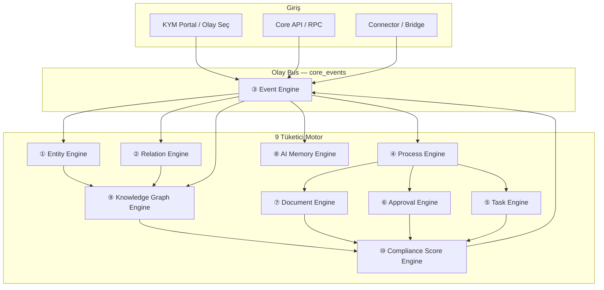
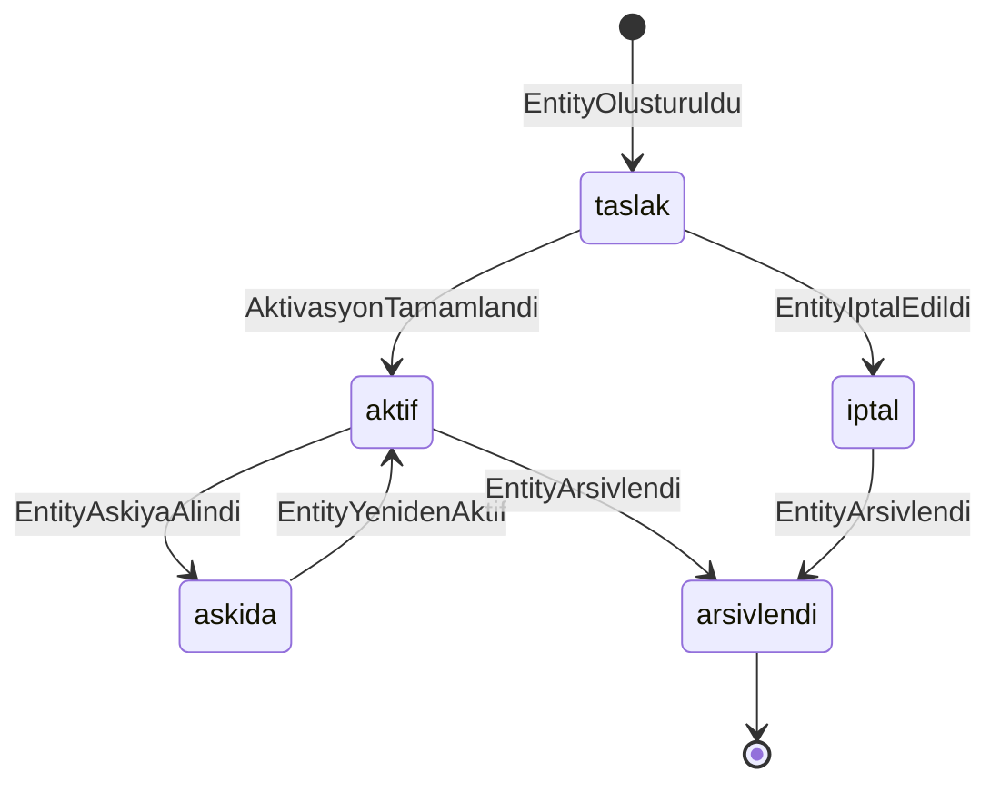
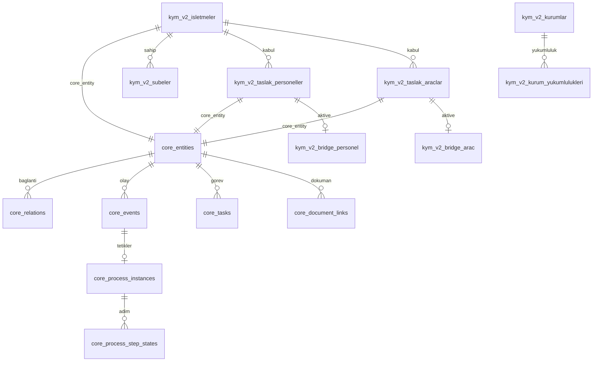
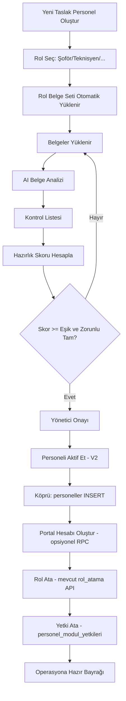

# FEYROUTE Master Architecture V1.0

## KYM V2 — Kurumsal Yaşam Döngüsü Merkezi

**Resmi belge adı:** FEYROUTE MASTER ARCHITECTURE V1.0  
**Ürün kapsamı:** KYM V2 (FeyRoute Core üzerinde çalışan ilk büyük modül)  
**Versiyon:** 1.0 (Freeze)  
**Durum:** Mimari donduruldu — Implementasyon onaylı  
**Seviye:** Enterprise  
**Son güncelleme:** 2026-07-09  
**İlişkili:** `01-master-overview.md`, `02-modul-envanteri.md`, `04-veritabani-haritasi.md`, `09-karar-defteri.md`, `10-core-v1-entity-spec.md`, `11-core-v1-event-taxonomy.md`

> **Versiyon notu:** Bu belge **FEYROUTE MASTER ARCHITECTURE V1.0** olarak dondurulmuştur. **KYM V2**, bu mimari üzerinde çalışan ilk büyük modüldür. Önceki taslak sürüm etiketleri (v2.1, v2.2) geçersizdir.

### Doküman Haritası

| Bölüm | İçerik |
|-------|--------|
| **0** | Değişmez kurallar |
| **G** | ★ V1.0 Freeze — SoT, tenant, bridge, events, namespace |
| **A** | Üç katmanlı platform (Core → KYM → İş Modülleri) |
| **E** | 10 evrensel motor (tam spesifikasyon) |
| **F** | Universal Entity Model (tam spesifikasyon) |
| **B–D** | Event-first, yaşam döngüsü, bilgi grafı |
| **1–19** | Veritabanı, portal, kabul merkezleri, belgeler, faz planı |

---

## 0. Değişmez Kurallar

| Kural | Açıklama |
|-------|----------|
| **Additive only** | Mevcut `personeller`, `araclar`, `varliklar`, operasyon, yetkilendirme tablolarına ve ekranlarına **dokunulmaz** |
| **Yeni namespace — iki katman** | Evrensel altyapı: `core_*` tabloları. Kurumsal yaşam döngüsü: `kym_v2_*` tabloları. Mevcut `kym_*` (V1) ile çakışmaz |
| **Mevcut ekranlar korunur** | Personel, Araç, Varlık, Operasyon, Yetkilendirme modüllerinin mevcut portal ekranları ve API'leri **değiştirilmez** |
| **Köprü, değil değişim** | İş modüllerine veri **aktivasyon köprüsü** (`kym_v2_bridge_*`) ile aktarılır; legacy şema değiştirilmez |
| **Eski modül silinmez** | V2 stabil ve geçiş tamamlanana kadar eski modüller çalışır |
| **Doğuş noktası KYM** | Yeni personel, araç, işletme kayıtları KYM V2 kabul merkezlerinde başlar |
| **Event-first** | Kullanıcı belge aramaz; **olay seçer** — sistem belge, görev, form ve onayı üretir |
| **Yaşam döngüsü** | Tüm değerli veri durum geçişleriyle yönetilir; fiziksel silme yok, arşiv ve geçmiş korunur |
| **Türkiye ölçeği** | Tek sektör / tek marka değil; çok sektörlü, çok şubeli, çok kurumlu işletmeler için tasarlanır |

### V2 KYM Rol Tanımı (8 Merkez)

```
KYM V2
├── Kurumsal Uyum Merkezi      (işletme + yükümlülük + denetim)
├── Kurumsal Kabul Merkezi     (işletme / şube doğumu)
├── Personel Kabul Merkezi     (taslak personel → aktif personel köprüsü)
├── Araç Kabul Merkezi         (taslak araç → filo köprüsü)
├── Süreç Yönetim Merkezi      (işe giriş, ruhsat, araç alım vb.)
├── Mevzuat Merkezi            (kurum + mevzuat + yükümlülük haritası)
├── Dijital Belge Merkezi      (belge yaşam döngüsü + arşiv)
└── AI Süreç Merkezi           (analiz, üretim, öneri, kontrol listesi)
```

### En Önemli Mimari Karar

**KYM tek başına bir belge modülü değildir.**

KYM V2, **FeyRoute Core** üzerinde çalışan **Kurumsal Yaşam Döngüsü Merkezi**dir (Corporate Lifecycle Center). Belgeler, süreçler, onaylar ve skorlar — hepsi Core'un **10 evrensel motoru** üzerinden yönetilir. KYM katmanı, bu motorları kurumsal uyum, kabul ve aktivasyon senaryolarına özgü şablonlar ve iş kuralları ile besler.

### Enterprise Mimari Özeti

| Özellik | Enterprise gereksinim |
|---------|-------------------------|
| **Motor sayısı** | 10 evrensel motor — modüler, bağımsız, orchestrated |
| **Kimlik modeli** | Universal Entity — tek kayıt, çok domain, kalıcı UUID |
| **Veri bütünlüğü** | Event-sourced, append-only, idempotent |
| **Çok kiracılık** | `isletme_id` tenant boundary + RLS |
| **Ölçek** | 10.000+ belge / işletme, 100+ şube, 81 il kurum kataloğu |
| **Uyumluluk** | KVKK, denetim izi, hukuki arşiv (silme yok) |
| **Entegrasyon** | Legacy köprü, connector pattern, feature flag |
| **AI güvenliği** | İnsan-onaylı yazma, ayrı hafıza namespace |

---

## G. Mimari Kesinleştirmeler (V1.0 Freeze)

Enterprise Review sonrası kapatılan 6 mimari karar. Implementasyon bu bölüme tabidir.

### G.1 Source of Truth (SoT) Matrisi

Her domain için **tek canonical kaynak** Core katmanındadır. KYM tabloları domain projection veya katalogdur; legacy tablolar köprü ile bağlanır.

| Domain | Canonical (Core — SoT) | Projection (KYM — türetilmiş) | Legacy ilişki |
|--------|------------------------|-------------------------------|---------------|
| **Belge** | `core_document_instances`, `core_document_versions`, `core_document_links` + `core_entities` (DOCUMENT) | `kym_v2_kurumsal_belgeler`, `kym_v2_personel_belgeleri`, `kym_v2_arac_belgeleri`, `kym_v2_belge_dosyalari` — domain alanları ve UI bağlamı | Yok — belge legacy modüllerde tutulmaz |
| **Süreç** | `core_process_instances`, `core_process_step_states` | `kym_v2_surec_ornekleri`, `kym_v2_surec_adim_durumlari` — KYM bağlamı (personel, kurum, şube) | Yok |
| **Süreç şablonu** | `core_process_definitions`, `core_process_steps` | `kym_v2_surec_tanimlari`, `kym_v2_surec_adimlari`, `kym_v2_olay_sablonlari` — Türkiye mevzuat şablonları | Yok |
| **Onay** | `core_approval_requests`, `core_approval_decisions` | `kym_v2_belge_onaylari` — yalnızca KYM UI özet projection (UAE'den türetilir, ayrı onay motoru değildir) | Yok |
| **Skor** | `core_compliance_scores`, `core_compliance_rules`, `core_compliance_violations` | `kym_v2_hazirlik_skorlari` — domain kırılım JSON (entity_type + entity_id) | Yok |
| **Görev (insan)** | `core_tasks`, `core_task_assignments`, `core_task_sla` | Yok — birleşik görev merkezi doğrudan `core_tasks` okur | Yok |
| **Görev (AI async)** | `core_ai_observations`, `core_ai_suggestions` (UAIM) | `kym_v2_ai_gorevleri` — AI iş kuyruğu metadata (UTE ile karıştırılmaz) | Yok |
| **Entity kimlik** | `core_entities`, `core_entity_identifiers`, `core_entity_state_history` | `kym_v2_taslak_personeller`, `kym_v2_taslak_araclar`, `kym_v2_isletmeler` — domain alanları | `kym_v2_bridge_*` → `personeller`, `araclar`, tenant |
| **Olay (teknik)** | `core_events` | `kym_v2_bridge_olaylari` — yalnızca köprü aktivasyon logu | Yok |
| **İlişki / Graf** | `core_relations` | `core_graph_nodes`, `core_graph_edges` (CKGE materialized) | Yok |

**SoT kuralları:**

| Kural | Açıklama |
|-------|----------|
| **SOT-1** | Canonical tabloya yalnızca ilgili Core motor yazar |
| **SOT-2** | Projection tablolar Core'dan türetilir; projection'a doğrudan iş kuralı yazılmaz |
| **SOT-3** | Projection ile canonical arasında çelişki varsa canonical geçerlidir |
| **SOT-4** | `kym_v2_personel_hazirlik_skorlari` / `kym_v2_arac_hazirlik_skorlari` ayrı SoT değildir — tüm skor projection'ı `kym_v2_hazirlik_skorlari` polymorphic tablosundadır |
| **SOT-5** | `kym_v2_skor_kurallari` ayrı kural motoru değildir — kural SoT = `core_compliance_rules`; KYM yalnızca domain etiketleri taşır |

### G.2 Tenant Standardı

**Kesin karar:** Tüm Core ve KYM tablolarında tenant sınır alanı **`isletme_id`** (UUID) kullanılır.

| Konu | Standard |
|------|----------|
| Alan adı | `isletme_id` — zorunlu, indexed, RLS anahtarı |
| Uyumluluk notu | Enterprise literatürde geçen `tenant_id` = **`isletme_id`** (aynı kavram, farklı ad). Bu belgede yalnızca `isletme_id` kullanılır |
| Core tablolar | `core_entities.isletme_id`, `core_events.isletme_id`, tüm `core_*` tenant-scoped tablolar |
| KYM tablolar | `kym_v2_*.isletme_id` |
| RLS | `auth.uid()` → `personeller` eşlemesi → `isletme_id` (mevcut tablo **okunur**, değiştirilmez) |
| Storage yolu | `{isletme_id}/...` |

### G.3 Bridge Transaction Sözleşmesi

Köprü RPC'leri (`kym_v2_personel_aktive_et`, `kym_v2_arac_filoya_aktar`, `kym_v2_isletme_aktive_et`) aşağıdaki sözleşmeye tabidir.

#### Başarılı işlem (happy path)

```
1. Ön koşul kontrolü (UCSE skor, onay, belgeler)
2. core_events: AktivasyonBasladi
3. Legacy INSERT (feature flag açıkken)
4. kym_v2_bridge_* INSERT (eşleme kaydı)
5. core_events: BridgeLegacyAktarildi
6. core_entity_state_history: durum → legacy_aktarildi
7. Opsiyonel adımlar (sıralı, aynı transaction dışında retry edilebilir):
   - Portal hesabı
   - Rol atama (mevcut API)
   - Yetki atama (mevcut API)
8. core_events: AktivasyonTamamlandi
```

#### Başarısız işlem

| Aşama | Davranış |
|-------|----------|
| Ön koşul fail | Legacy'ye yazma yok; `AktivasyonBasarisiz` olayı; kullanıcıya eksik liste |
| Legacy INSERT fail | Bridge kaydı yok; `BridgeLegacyHatasi` olayı; V2 taslak durumu değişmez |
| Bridge kaydı fail | Legacy INSERT **compensation** (aşağıya bak) |
| Portal/rol/yetki fail | Legacy kayıt **korunur**; `AktivasyonKismiTamamlandi` olayı; manuel tamamlama görevi (`core_tasks`) |

#### Rollback

| Durum | Rollback |
|-------|----------|
| Legacy INSERT öncesi hata | Rollback gerekmez — hiçbir yan etki yok |
| Legacy INSERT sonrası bridge fail | **Compensation zorunlu** — legacy kayıt silinmez (legacy şemaya DELETE kuralı yok); bunun yerine legacy kayıt `status=inactive` veya mevcut şemadaki eşdeğer alan ile işaretlenir + `BridgeCompensation` olayı |
| Kısmi aktivasyon (portal fail) | Legacy rollback yok; V2 bridge kaydı geçerli kalır; görev ile tamamlanır |

**Kritik:** Legacy tablolarda DELETE veya şema değişikliği yapılmaz. Compensation yalnızca mevcut legacy alanları ile işaretleme veya operatör müdahalesi ile yapılır.

#### Idempotency

| Kural | Açıklama |
|-------|----------|
| **BRG-1** | Her aktivasyon denemesi `idempotency_key` taşır: `bridge:{entity_type}:{taslak_id}:{islem}` |
| **BRG-2** | Aynı key ile tekrar çağrı → mevcut `kym_v2_bridge_*` kaydı döner; duplicate INSERT yapılmaz |
| **BRG-3** | Başarılı bridge sonrası tekrar çağrı → `200 OK` + mevcut eşleme (no-op) |
| **BRG-4** | Tüm adımlar `kym_v2_bridge_olaylari`'na append-only loglanır |

#### Compensation

| Tetikleyici | Compensation aksiyonu |
|-------------|---------------------|
| Bridge INSERT fail after legacy INSERT | Legacy kayıt inactive işaretle + `BridgeCompensation` olayı + IK görevi |
| Duplicate legacy conflict (unique violation) | Aktivasyon durdur; mevcut legacy kayıt `core_entity_identifiers` ile eşleştirilmeye çalışılır; eşleşme yoksa manuel review görevi |
| Feature flag kapalı | Legacy INSERT atlanır; yalnızca V2 durum `aktivasyona_hazir` kalır |

### G.4 `core_events` ve `core_operation_events` Birlikte Çalışma Kuralları

İki append-only olay akışı **ayrı kalır**; Phase-1'de birleştirilmez.

| Özellik | `core_events` | `core_operation_events` |
|---------|-----------------|-------------------------|
| **Amaç** | Kurumsal yaşam döngüsü (KYM, uyum, kabul, aktivasyon) | Operasyonel servis hattı (müşteri, ürün, servis emri, ARON) |
| **Yazar** | KYM V2, Core motorlar, köprü RPC | Core V1 ingest, operasyon modülleri, ARON adapter |
| **Okuyucu** | KYM portal, UCSE, CKGE, UAE, UTE | Operasyon Havuzu, AI Operasyon Merkezi, Core V1 raporları |
| **Aggregate tipleri** | `isletme`, `personel`, `arac`, `belge`, `surec`, `olay` | `customer`, `product`, `service_order` |
| **KYM yazar mı?** | Evet — birincil olay bus | Hayır — salt okunur (gelecek entegrasyon) |
| **Birleşme** | Phase-2+ değerlendirmesi; V1.0'da birleştirilmez | Değişmez — mevcut operasyon yolu korunur |

**Olay yönlendirme kuralları:**

| Olay tipi | Hedef akış |
|-----------|------------|
| PersonelKabulBasladi, BelgeYuklendi, AktivasyonTamamlandi | `core_events` |
| SkorGuncellendi, OnayVerildi, SurecAdimiTamamlandi | `core_events` |
| ImportedFromAron, ServiceOrderCreated, CustomerCreated | `core_operation_events` |
| BridgeLegacyAktarildi | `core_events` (+ `kym_v2_bridge_olaylari` projection) |

**Çapraz ilişkilendirme (opsiyonel, V1.0):**

- `core_events.event_payload.cross_ref` alanında `core_operation_events.id` referansı tutulabilir
- Zorunlu değildir; yalnızca operasyon-kurumsal korelasyon gerektiğinde (ör. teknisyen kabul → servis emri atama Phase-2)
- `core_operation_events` → `core_events` yönünde otomatik yazma **yok**

### G.5 Namespace Standardı

| Katman | Desen | Örnek | Not |
|--------|-------|-------|-----|
| **Tablo (Core)** | `core_{domain}` | `core_entities`, `core_events` | snake_case, `core_` prefix |
| **Tablo (KYM)** | `kym_v2_{domain}` | `kym_v2_taslak_personeller` | snake_case, `kym_v2_` prefix |
| **Tablo (Köprü)** | `kym_v2_bridge_{entity}` | `kym_v2_bridge_personel` | Legacy eşleme only |
| **View (Core)** | `v_core_{name}` | `v_core_entity_graph` | `v_` + owner prefix |
| **View (KYM)** | `v_kym_v2_{name}` | `v_kym_v2_dashboard_ozet` | `v_` + owner prefix |
| **RPC (Core)** | `core_{motor}_{action}` | `core_event_publish`, `core_entity_create` | Core motor işlemleri |
| **RPC (KYM)** | `kym_v2_{action}` | `kym_v2_personel_aktive_et` | Domain/köprü işlemleri |
| **Storage (Core)** | `core-{bucket}` | `core-documents` | kebab-case |
| **Storage (KYM)** | `kym-v2-{bucket}` | `kym-v2-belgeler`, `kym-v2-ai-uretim` | kebab-case, `v2` segment |
| **API (Core)** | `/api/core-v1/{resource}` | `/api/core-v1/events` | Operasyonel Core V1 mevcut yol korunur |
| **API (KYM V2)** | `/api/kym-v2/{resource}` | `/api/kym-v2/belge-analiz` | KYM domain API |
| **Portal (KYM V2)** | `/portal/kym-v2/{path}` | `/portal/kym-v2/olaylar` | Yeni ekranlar |
| **Modül kodu** | `kym_v2_{feature}` | `kym_v2_personel_kabul` | `moduller` tablosuna yeni satır |

**Uyumluluk:**

- V1 `kym_*` tabloları, `kym-belgeleri` bucket, `/portal/kym` route — dokunulmaz
- Legacy tablolar namespace dışı — köprü ile bağlanır

### G.6 Versiyon ve Freeze Beyanı

| Alan | Değer |
|------|-------|
| Resmi belge adı | **FEYROUTE MASTER ARCHITECTURE V1.0** |
| Dosya | `docs/feyroute-master/13-kym-v2-mimari.md` |
| İlk büyük modül | **KYM V2** — Kurumsal Yaşam Döngüsü Merkezi |
| Freeze tarihi | 2026-07-09 |
| Implementasyon | Faz 1 onayı ile başlar; bu belge dışına çıkılamaz (karar defteri ile değişir) |

---

## A. Üst Mimari — Üç Katmanlı Platform

FeyRoute platformu üç katmandan oluşur. Alt katman üst katmana hizmet eder; üst katman alt katmanın tablolarına doğrudan yazmaz.

```
┌─────────────────────────────────────────────────────────────────────┐
│  KATMAN 3 — İş Modülleri (Legacy + Operasyonel)                     │
│  Personel │ Araç │ Varlık │ Operasyon │ Muhasebe │ Depo │ Bayi │ AI│
│  (mevcut tablolar ve ekranlar — değiştirilmez)                      │
└───────────────────────────────┬─────────────────────────────────────┘
                                │ Köprü (kym_v2_bridge_*)
                                │ Feature flag ile INSERT
┌───────────────────────────────▼─────────────────────────────────────┐
│  KATMAN 2 — KYM V2 (Kurumsal Yaşam Döngüsü Merkezi)                 │
│  Personel/Araç/İşletme Kabul │ Belgeler │ Mevzuat │ Denetim │ Uyum │
│  Süreçler │ AI Belge Üretimi │ Hazırlık/Uyum Skorları              │
│  (kym_v2_* tabloları)                                               │
└───────────────────────────────┬─────────────────────────────────────┘
                                │ Core API / RPC
┌───────────────────────────────▼─────────────────────────────────────┐
│  KATMAN 1 — FeyRoute Core (Evrensel Altyapı — 10 Motor)             │
│  ① Entity ② Relation ③ Event ④ Process ⑤ Task ⑥ Approval           │
│  ⑦ Document ⑧ AI Memory ⑨ Knowledge Graph ⑩ Compliance Score      │
│  (core_* tabloları)                                                 │
└─────────────────────────────────────────────────────────────────────┘
```

> **Katman 1 Enterprise detay:** 10 evrensel motor → **Bölüm E**. Universal Entity Model → **Bölüm F**. Katman 2–3 özeti → **A (devam)** aşağıda.

## E. FeyRoute Core Enterprise — 10 Evrensel Motor

### E.0 Motor Orkestrasyon Mimarisi

10 motor bir **event bus** üzerinden sıralı veya paralel çalışır. Tek giriş noktası: `core_events`. Motorlar birbirinin tablosuna doğrudan yazmaz; yalnızca olay tüketir ve kendi namespace'ine yazar.



**Orkestrasyon kuralları:**

| Kural | Açıklama |
|-------|----------|
| **E-1** | Her motor idempotent — aynı `idempotency_key` ile tekrar çalıştırma güvenli |
| **E-2** | Motor hatası = `MotorHatasi` olayı; compensation = yeni olay (saga) |
| **E-3** | Motor sırası tanımlı: Entity → Relation → Process → Task/Approval/Document → AI → Graph → Score |
| **E-4** | Skor motoru (⑩) her zaman son çalışır — tüm bağımlı motorlar tamamlandıktan sonra |
| **E-5** | AI motoru (⑧) operasyonel tablolara yazmaz; yalnızca `core_ai_*` |
| **E-6** | Tüm motor çıktıları `core_events` ile auditable |

### E.1 Motor Envanteri

| # | Motor | Kod | Core Tablolar | Sorumluluk |
|---|-------|-----|---------------|------------|
| ① | **Universal Entity Engine** | `UEE` | `core_entities`, `core_entity_types`, `core_entity_state_history`, `core_entity_identifiers` | Kalıcı kimlik, tip taksonomisi, durum makinesi |
| ② | **Universal Relation Engine** | `URE` | `core_relations`, `core_relation_types` | Nesneler arası bağ, geçmiş, zimmet, sahiplik |
| ③ | **Universal Event Engine** | `UEventE` | `core_events`, `core_event_types`, `core_event_subscriptions` | Append-only olay bus, tetikleme, idempotency |
| ④ | **Universal Process Engine** | `UPE` | `core_process_definitions`, `core_process_instances`, `core_process_steps`, `core_process_step_states` | Süreç şablonu, instance, adım yürütme |
| ⑤ | **Universal Task Engine** | `UTE` | `core_tasks`, `core_task_assignments`, `core_task_sla` | İnsan görevleri, SLA, eskalasyon |
| ⑥ | **Universal Approval Engine** | `UAE` | `core_approval_flows`, `core_approval_requests`, `core_approval_decisions` | Çok kademeli onay, veto, delegasyon |
| ⑦ | **Universal Document Library** | `UDL` | `core_document_templates`, `core_document_instances`, `core_document_versions`, `core_document_links` | Şablon, versiyon, arşiv, storage bağlantısı |
| ⑧ | **Universal AI Memory Engine** | `UAIM` | `core_ai_observations`, `core_ai_suggestions`, `core_ai_context_snapshots`, `core_ai_learning_signals` | Analiz, öneri, bağlam, öğrenme sinyali |
| ⑨ | **Corporate Knowledge Graph Engine** | `CKGE` | `core_graph_nodes` (materialized), `core_graph_edges` (materialized), view: `v_core_entity_graph` | Etki analizi, traversal, risk yolu |
| ⑩ | **Universal Compliance & Score Engine** | `UCSE` | `core_compliance_rules`, `core_compliance_scores`, `core_compliance_violations` | 0–100 hazırlık/uyum skoru, ihlal tespiti |

*KYM domain skorları (`kym_v2_hazirlik_skorlari`) UCSE'nin kurumsal uzantısıdır; hesaplama UCSE'de, domain kırılımı KYM'de tutulur.*

### E.2 Motorlar Arası Sözleşme (Enterprise API Boundary)

Her motor expose eder:

| Bileşen | Açıklama |
|---------|----------|
| `register()` | Motor başlatma, event subscription |
| `handle_event(event)` | Olay tüketimi — idempotent |
| `get_state(entity_id)` | Anlık durum sorgusu |
| `emit_events[]` | Üretebileceği olay tipleri listesi |
| `consume_events[]` | Dinlediği olay tipleri listesi |
| `health_check()` | Motor sağlık durumu |

**Örnek subscription matrisi (özet):**

| Olay tipi | Tüketici motorlar |
|-----------|-------------------|
| `KurumsalOlayBasladi` | UEE, UPE, UTE |
| `EntityOlusturuldu` | URE, CKGE |
| `BelgeYuklendi` | UDL, UAIM, UCSE |
| `OnayVerildi` | UPE, UCSE |
| `SurecAdimiTamamlandi` | UTE, UAE, UCSE |
| `SkorGuncellendi` | UEventE (audit), KYM dashboard |

---

### E.3 ① Universal Entity Engine (UEE) — Enterprise

#### Sorumluluk
Tüm FeyRoute iş nesnelerinin **tek kimlik kaynağı** (System of Identity). Personel, araç, belge, kurum — hepsi önce UEE'de doğar; domain tabloları (`kym_v2_*`, `personeller`) uzantı veya köprüdür.

#### Enterprise Kurallar

| Kural | Açıklama |
|-------|----------|
| **UEE-1** | `entity_id` (UUID) kalıcıdır; asla yeniden kullanılmaz, asla değişmez |
| **UEE-2** | Bir nesne yalnızca bir `entity_type` + `entity_subtype` taşır; tip değişimi = yeni olay + subtype güncelleme |
| **UEE-3** | Durum geçişleri yalnızca UEE veya yetkili motor (UPE, UAE) tarafından yapılır |
| **UEE-4** | Her durum geçişi `core_entity_state_history`'ye append-only yazılır |
| **UEE-5** | Entity fiziksel silinmez; `arsivlendi_at` + `EntityArsivlendi` olayı |
| **UEE-6** | Legacy eşleme `core_entity_identifiers` tablosunda; UEE legacy tablolara FK taşımaz |
| **UEE-7** | Aynı iş nesnesi için çoklu identifier desteklenir (vergi_no, plaka, SGK sicil) |
| **UEE-8** | Tenant izolasyonu: `isletme_id` zorunlu (bkz. G.2) |

#### Entity Tip Taksonomisi (Enterprise)

```
core_entity_types
├── ORGANIZATION
│   ├── isletme
│   ├── sube
│   ├── franchise
│   └── ortaklik
├── PERSON
│   ├── taslak_personel
│   ├── aktif_personel
│   ├── yonetici
│   └── tedarikci_temsilci
├── ASSET
│   ├── taslak_arac
│   ├── aktif_arac
│   ├── varlik
│   └── ekipman
├── DOCUMENT
│   ├── kurumsal_belge
│   ├── personel_belgesi
│   ├── arac_belgesi
│   └── ai_uretim_belgesi
├── INSTITUTION
│   ├── kurum
│   └── kurum_subesi
├── REGULATION
│   ├── mevzuat
│   └── yukumluluk
├── PROCESS
│   ├── surec_instance
│   └── olay_instance
├── RISK
│   ├── uyum_riski
│   ├── denetim_riski
│   └── ceza_riski
└── FINANCIAL
    ├── odeme_kalemi
    └── harc
```

---

### E.4 ② Universal Relation Engine (URE) — Enterprise

#### Sorumluluk
Entity'ler arası tüm bağları **tek graf kenarı modeli** ile yönetir. Zimmet, sahiplik, belge bağlantısı, kurum ilişkisi — hepsi URE'de.

#### Enterprise Kurallar

| Kural | Açıklama |
|-------|----------|
| **URE-1** | Her kenar: `source_entity_id`, `target_entity_id`, `relation_type`, `valid_from`, `valid_to` |
| **URE-2** | Kenar silinmez; sonlandırma = `valid_to` + `RelationSonlandirildi` olayı |
| **URE-3** | Çoklu aktif kenar desteklenir (personel → N belge) |
| **URE-4** | Döngüsel kenar yasak değil; traversal derinlik limiti = 10 |
| **URE-5** | `relation_strength`: `mandatory`, `recommended`, `optional`, `deprecated` |
| **URE-6** | Zimmet kenarı sonlandığında bağlı görev ve skor motoru otomatik tetiklenir |

#### Relation Tip Kataloğu

`sahiplik | alt_birim | zimmet | bagli_belge | basvuru_kurumu | mevzuat_kaynak | denetim_kaynak | surec_konusu | onay_hedefi | odeme_kalemi | franchise_baglantisi | tedarikci_baglantisi | risk_baglantisi`

---

### E.5 ③ Universal Event Engine (UEventE) — Enterprise

#### Sorumluluk
Platformun **sinir sistemi**. Tüm motorlar ve modüller arası iletişim yalnızca olaylar üzerinden.

#### Enterprise Kurallar

| Kural | Açıklama |
|-------|----------|
| **UEventE-1** | INSERT-only; UPDATE/DELETE kesinlikle yasak |
| **UEventE-2** | `idempotency_key` zorunlu (connector ve API için) |
| **UEventE-3** | `event_version` ile payload şema evrimi |
| **UEventE-4** | `correlates_to_event_id` ile düzeltme zinciri |
| **UEventE-5** | `causation_id` — hangi olay bu olayı tetikledi (trace) |
| **UEventE-6** | `aggregate_id` + `aggregate_type` — event sourcing aggregate |
| **UEventE-7** | Olay saklama: minimum 10 yıl (hukuki arşiv) |
| **UEventE-8** | `core_event_subscriptions` ile motor routing |

#### Olay Kategorileri (Enterprise Taksonomi)

| Kategori | Örnek olaylar |
|----------|---------------|
| **Lifecycle** | `EntityOlusturuldu`, `DurumDegisti`, `EntityArsivlendi` |
| **Kurumsal** | `KurumsalOlayBasladi`, `PersonelKabulBasladi`, `DenetimGeldi` |
| **Belge** | `BelgeYuklendi`, `BelgeDogrulandi`, `BelgeSuresiDoldu`, `BelgeGizlendi` |
| **Süreç** | `SurecBasladi`, `SurecAdimiTamamlandi`, `SurecTamamlandi`, `SurecIptal` |
| **Onay** | `OnayTalebiAcildi`, `OnayVerildi`, `OnayReddedildi`, `OnayDelegasyonu` |
| **Görev** | `GorevOlusturuldu`, `GorevTamamlandi`, `GorevGecikti`, `GorevEskalade` |
| **Aktivasyon** | `AktivasyonBasladi`, `AktivasyonTamamlandi`, `BridgeLegacyAktarildi` |
| **Uyum** | `SkorGuncellendi`, `UyumIhlaliTespitEdildi`, `RiskTespitEdildi` |
| **AI** | `AiAnalizTamamlandi`, `AiOneriUretildi`, `AiOneriKabulEdildi` |
| **Sistem** | `MotorHatasi`, `MotorCompensation`, `SagaTamamlandi` |

---

### E.6 ④ Universal Process Engine (UPE) — Enterprise

#### Sorumluluk
İş süreçlerinin tanımı, instance yönetimi ve adım yürütmesi. BPMN-benzeri ancak event-sourced.

#### Enterprise Kurallar

| Kural | Açıklama |
|-------|----------|
| **UPE-1** | Süreç tanımı versiyonlu (`definition_version`); çalışan instance eski versiyonda kalır |
| **UPE-2** | Adım tipleri sabit enum: `belge_topla`, `form_doldur`, `basvuru_yap`, `odeme_yap`, `onay_al`, `denetim_hazirlik`, `ai_uret`, `bekle`, `manuel`, `sub_process` |
| **UPE-3** | Paralel adım desteği (fork/join) |
| **UPE-4** | Alt süreç (sub-process) çağrısı |
| **UPE-5** | SLA: adım bazlı `max_duration_hours`; aşım = `GorevGecikti` |
| **UPE-6** | Compensation: iptal = ters adımlar saga ile |

#### Süreç → Motor Mapping

| Adım tipi | Tetiklenen motor |
|-----------|------------------|
| `belge_topla` | UDL + UTE |
| `form_doldur` | UDL + UTE |
| `onay_al` | UAE |
| `ai_uret` | UAIM + UDL |
| `odeme_yap` | UTE + UCSE |
| `denetim_hazirlik` | UTE + CKGE + UCSE |

---

### E.7 ⑤ Universal Task Engine (UTE) — Enterprise

#### Sorumluluk
İnsan tarafından yapılacak işlerin atama, takip, SLA ve eskalasyonu.

#### Enterprise Kurallar

| Kural | Açıklama |
|-------|----------|
| **UTE-1** | Görev yalnızca olay veya süreç adımından üretilir; manuel görev = `ManuelGorevOlusturuldu` olayı |
| **UTE-2** | Atama: `atanan_rol`, `atanan_kullanici_id`, veya `atanan_kuyruk` |
| **UTE-3** | SLA ihlali → eskalasyon zinciri (IK → Yönetici → Admin) |
| **UTE-4** | Görev tamamlama = `GorevTamamlandi` olayı → UPE'ye geri bildirim |
| **UTE-5** | Görev öncelik: `kritik`, `yuksek`, `normal`, `dusuk` |
| **UTE-6** | Birleşik görev merkezi tüm modüllerden görevleri listeler |

#### Görev Tipleri

`belge_yukle | form_doldur | onay_ver | odeme_yap | basvuru_yap | kontrol_yap | imza_al | bilgi_gir | arama_yap | ziyaret_yap`

---

### E.8 ⑥ Universal Approval Engine (UAE) — Enterprise

#### Sorumluluk
Çok kademeli, rol bazlı, delegasyonlu onay akışları.

#### Enterprise Kurallar

| Kural | Açıklama |
|-------|----------|
| **UAE-1** | Onay kararı append-only (`core_approval_decisions`) |
| **UAE-2** | Red = zorunlu gerekçe + `OnayReddedildi` olayı |
| **UAE-3** | Delegasyon: `delegated_from_user_id` + süre sınırı |
| **UAE-4** | Paralel onay (tümü) ve sıralı onay (biri) desteklenir |
| **UAE-5** | Onay hedefi: entity, belge, süreç adımı, AI çıktısı, aktivasyon |
| **UAE-6** | SLA: onay bekleme süresi aşımı → eskalasyon |

#### Onay Akış Şablonları (KYM)

| Akış | Kademeler |
|------|-----------|
| Personel aktivasyon | IK → Servis Yöneticisi |
| Araç filo transfer | Filo Sorumlusu → Yönetici |
| AI belge üretim | Kullanıcı → (opsiyonel) Hukuk |
| Kurumsal belge | Departman → Yönetici |
| Ceza/itiraz | Muhasebe → Yönetici |

---

### E.9 ⑦ Universal Document Library (UDL) — Enterprise

#### Sorumluluk
Tüm dijital dokümanların şablon, instance, versiyon ve arşiv yönetimi.

#### Enterprise Kurallar

| Kural | Açıklama |
|-------|----------|
| **UDL-1** | Her doküman bir `core_entities` (DOCUMENT tipi) ile eşleşir |
| **UDL-2** | Versiyon append-only; eski versiyon erişilebilir |
| **UDL-3** | Storage: hash doğrulama (SHA-256), mime type kontrolü |
| **UDL-4** | Şablon versiyonlu; üretim hangi şablon versiyonunu kullandığını bilir |
| **UDL-5** | Hukuki saklama süresi metadata'da (`retention_years`) |
| **UDL-6** | Erişim: RLS + entity bağlantısı üzerinden |
| **UDL-7** | AI üretim çıktısı = `ai_uretim_belgesi` subtype, watermark zorunlu |

#### Doküman Yaşam Döngüsü (UDL)

`taslak → uretildi → yuklendi → ai_incelemede → onay_bekliyor → dogrulandi → arsivlendi`

---

### E.10 ⑧ Universal AI Memory Engine (UAIM) — Enterprise

#### Sorumluluk
AI analiz, öneri ve kurumsal hafıza. Operasyonel veriye yazmaz.

#### Enterprise Kurallar

| Kural | Açıklama |
|-------|----------|
| **UAIM-1** | AI çıktısı her zaman `confidence_score` (0–1) taşır |
| **UAIM-2** | Düşük güven (&lt; 0.7) = otomatik insan inceleme görevi |
| **UAIM-3** | `core_ai_context_snapshots` = olay anı graf + entity özeti |
| **UAIM-4** | İnsan düzeltmesi = `core_ai_learning_signals` (Phase-2 fine-tuning) |
| **UAIM-5** | PII maskeleme log'da zorunlu |
| **UAIM-6** | AI öneri kabul/red geçmişi auditable |
| **UAIM-7** | Mevzuat referansları `source_citation` ile kaynak gösterir |

#### AI Yetki Sınırları

| İşlem | AI yapabilir | İnsan onayı |
|-------|-------------|-------------|
| Belge analizi (OCR, alan çıkarma) | ✓ | Düşük güvende zorunlu |
| Eksik belge tespiti | ✓ | — |
| Dilekçe/form taslağı üretimi | ✓ | Yayınlamadan önce zorunlu |
| Onay verme | ✗ | — |
| Durum değiştirme | ✗ | — |
| Legacy tabloya yazma | ✗ | — |

---

### E.11 ⑨ Corporate Knowledge Graph Engine (CKGE) — Enterprise

#### Sorumluluk
Entity + Relation + Event verisinden **sorgulanabilir kurumsal bilgi grafı** üretir.

#### Enterprise Kurallar

| Kural | Açıklama |
|-------|----------|
| **CKGE-1** | Graf materialized view; kaynak: UEE + URE + UEventE |
| **CKGE-2** | Yenileme: olay bazlı (incremental) + gece batch (full reconcile) |
| **CKGE-3** | Traversal derinlik limiti: 10 (performans) |
| **CKGE-4** | Risk yolu algoritması: BFS ile en kısa risk zinciri |
| **CKGE-5** | Etki analizi: entity kapatma simülasyonu (dry-run) |
| **CKGE-6** | AI context için subgraph export (max 50 node) |

#### Graf Sorgu API (Tasarım)

| Sorgu | Dönüş |
|-------|-------|
| `neighbors(entity_id, depth)` | Komşu entity listesi |
| `risk_path(entity_id)` | Entity → Risk zinciri |
| `impact_analysis(entity_id)` | Etkilenen entity sayısı ve listesi |
| `compliance_subgraph(entity_id)` | Belge + kurum + mevzuat alt grafı |
| `zimmet_chain(personel_id)` | Personel → Araç → Şube → İşletme zinciri |

---

### E.12 ⑩ Universal Compliance & Score Engine (UCSE) — Enterprise

#### Sorumluluk
0–100 hazırlık ve uyum skoru hesaplama, ihlal tespiti, aktivasyon kapı kontrolü.

#### Enterprise Kurallar

| Kural | Açıklama |
|-------|----------|
| **UCSE-1** | Skor her skor-etkileyen olayda yeniden hesaplanır (event-driven) |
| **UCSE-2** | Skor geçmişi append-only (`core_compliance_scores`) |
| **UCSE-3** | Kural motoru: `core_compliance_rules` (ağırlık, ceza, eşik) |
| **UCSE-4** | İhlal = `UyumIhlaliTespitEdildi` olayı + otomatik görev |
| **UCSE-5** | Aktivasyon kapısı: skor ≥ eşik AND ihlal = 0 AND onay tamam |
| **UCSE-6** | Entity bazlı: `isletme`, `personel`, `arac`, `belge`, `sube` |
| **UCSE-7** | KYM `kym_v2_hazirlik_skorlari` = UCSE çıktısının domain projection'ı |

#### Skor Hesaplama Modeli

```
base_score = 100
for each rule in active_rules(entity):
  if violation: base_score -= rule.penalty
  if missing_mandatory: base_score -= rule.missing_penalty
  if expired_document: base_score -= rule.expiry_penalty
final_score = max(0, min(100, base_score))
```

#### Aktivasyon Eşikleri (Yapılandırılabilir)

| Entity | Varsayılan eşik | Ek şart |
|--------|-----------------|---------|
| Personel | ≥ 85 | Zorunlu belge tamam, onay var |
| Araç | ≥ 80 | Ruhsat + sigorta + muayene OK |
| İşletme | ≥ 70 | Vergi levhası + ticaret sicil + ruhsat |
| Şube | ≥ 75 | Adres belgesi + ruhsat |

### E.13 Enterprise Çapraz Kesit Gereksinimleri

Tüm 10 motor için geçerli enterprise standartları:

#### Güvenlik ve Tenant İzolasyonu

| Gereksinim | Uygulama |
|------------|----------|
| Multi-tenancy | `isletme_id` her Core tablosunda; RLS zorunlu (bkz. G.2) |
| Veri izolasyonu | Tenant A, Tenant B verisini göremez |
| PII koruması | TC kimlik hash; ham TC yalnızca şifreli domain tablosunda |
| AI veri sınırı | UAIM yalnızca tenant kapsamındaki entity'lere erişir |
| Audit | Tüm motor yazmaları `core_events` ile izlenebilir |

#### Gözlemlenebilirlik (Observability)

| Metrik | Motor |
|--------|-------|
| `motor_event_latency_ms` | Olay işleme süresi (motor başına) |
| `motor_error_rate` | Hata oranı |
| `task_sla_breach_count` | UTE SLA ihlali |
| `approval_pending_age_hours` | UAE bekleme süresi |
| `compliance_score_distribution` | UCSE skor dağılımı |
| `graph_refresh_lag_seconds` | CKGE güncellik gecikmesi |

#### Tutarlılık ve Hata Toleransı

| Pattern | Uygulama |
|---------|----------|
| Idempotency | `idempotency_key` tüm API ve connector girişlerinde |
| Saga / Compensation | Süreç iptali = ters adımlar `MotorCompensation` olayı ile |
| Eventual consistency | CKGE ve UCSE olay sonrası async güncellenir |
| Dead letter | `MotorHatasi` + retry kuyruğu (max 3 deneme) |

#### Performans Hedefleri (Enterprise SLO)

| İşlem | Hedef |
|-------|-------|
| Olay kayıt (UEventE) | &lt; 100ms p95 |
| Entity oluşturma (UEE) | &lt; 200ms p95 |
| Skor hesaplama (UCSE) | &lt; 500ms p95 (tek entity) |
| Graf sorgu (CKGE) | &lt; 1s p95 (depth ≤ 5) |
| Görev listesi (UTE) | &lt; 300ms p95 |

---

## F. Universal Entity Model — Enterprise Spesifikasyonu

### F.1 Tanım

**Universal Entity Model (UEM)**, FeyRoute platformundaki her iş nesnesinin tek, kalıcı, polymorphic kimlik kaydıdır. UEM, UEE motorunun veri modelidir ve tüm diğer 9 motorun `entity_id` referans aldığı temel yapıdır.

### F.2 UEM vs Domain Tabloları

| Katman | Tablo | Rol |
|--------|-------|-----|
| **UEM (Core)** | `core_entities` | Kimlik, tip, durum, tenant |
| **UEM (Core)** | `core_entity_identifiers` | Vergi no, plaka, SGK no gibi alternatif kimlikler |
| **UEM (Core)** | `core_entity_state_history` | Durum geçiş geçmişi |
| **Domain (KYM)** | `kym_v2_taslak_personeller` | Personel domain alanları (ad, rol, ehliyet…) |
| **Domain (KYM)** | `kym_v2_taslak_araclar` | Araç domain alanları (plaka, şasi, marka…) |
| **Legacy** | `personeller`, `araclar` | Operasyonel kayıt — köprü ile bağlanır |

**Enterprise kural:** Domain tablosu `core_entity_id` FK taşır. Legacy tablo `core_entity_id` taşımaz; `kym_v2_bridge_*` eşlemesi yeterlidir.

### F.3 UEM Alan Spesifikasyonu (Enterprise)

#### `core_entities`

| Alan | Tip | Zorunlu | Açıklama |
|------|-----|---------|----------|
| `id` | UUID | ✓ | PK — kalıcı kimlik |
| `isletme_id` | UUID | ✓ | Tenant / işletme kapsamı (bkz. G.2) |
| `entity_type` | TEXT | ✓ | UEE taksonomisinden |
| `entity_subtype` | TEXT | ✓ | Alt tip (taslak_personel, aktif_arac…) |
| `display_name` | TEXT | ✓ | UI'da gösterilen ad |
| `durum` | TEXT | ✓ | Anlık yaşam döngüsü durumu |
| `durum_degisti_at` | TIMESTAMPTZ | ✓ | Son durum geçiş zamanı |
| `metadata` | JSONB | — | Tip-özel hafif alanlar (ağır alanlar domain tablosunda) |
| `source_system` | TEXT | ✓ | `KYM`, `FEYROUTE`, `BRIDGE`, `IMPORT` |
| `source_reference` | TEXT | — | Dış kaynak referansı |
| `olusturulma_olayi_id` | UUID | ✓ | FK → `core_events.id` |
| `aktif` | BOOLEAN | ✓ | Soft delete bayrağı (default true) |
| `arsivlendi_at` | TIMESTAMPTZ | — | Arşiv zamanı |
| `created_at` | TIMESTAMPTZ | ✓ | Immutable |
| `created_by` | UUID | — | Oluşturan kullanıcı |

#### `core_entity_identifiers`

| Alan | Tip | Açıklama |
|------|-----|----------|
| `entity_id` | UUID | FK → `core_entities.id` |
| `identifier_type` | TEXT | `vergi_no`, `plaka`, `sgk_sicil`, `tc_hash`, `legacy_personel_id` |
| `identifier_value` | TEXT | Normalize edilmiş değer |
| `valid_from` | TIMESTAMPTZ | Geçerlilik başlangıcı |
| `valid_to` | TIMESTAMPTZ | NULL = aktif |
| `is_primary` | BOOLEAN | Birincil identifier |

#### `core_entity_state_history`

| Alan | Tip | Açıklama |
|------|-----|----------|
| `entity_id` | UUID | FK |
| `onceki_durum` | TEXT | — |
| `yeni_durum` | TEXT | — |
| `gecis_olayi_id` | UUID | FK → `core_events.id` |
| `gecis_nedeni` | TEXT | İnsan/AI/sistem açıklaması |
| `recorded_at` | TIMESTAMPTZ | Append-only |

### F.4 UEM Yaşam Döngüsü



### F.5 UEM Oluşturma Akışı (Enterprise)

```
1. Kullanıcı olay seçer (Yeni personel)
2. UEventE: KurumsalOlayBasladi
3. UEE: core_entities INSERT (type=PERSON, subtype=taslak_personel, durum=taslak)
4. UEE: core_entity_state_history INSERT
5. KYM: kym_v2_taslak_personeller INSERT (core_entity_id FK)
6. URE: ilişkiler (personel → isletme, personel → sube)
7. UPE: işe giriş süreci başlat
8. UTE: görevler üret
9. CKGE: graf güncelle
10. UCSE: başlangıç skoru hesapla (düşük — belgeler eksik)
```

### F.6 UEM — Legacy Köprü Modeli

```
core_entities (taslak_personel)
  ↓ core_entity_id
kym_v2_taslak_personeller
  ↓ aktivasyon (Faz 5)
kym_v2_bridge_personel
  ↓ legacy_personel_id
personeller (mevcut tablo — INSERT only, şema değişmez)
```

### F.7 UEM Enterprise Garantileri

| Garanti | Mekanizma |
|---------|-----------|
| **Kimlik benzersizliği** | UUID v4 + `core_entity_identifiers` unique constraint |
| **Tenant izolasyonu** | RLS `isletme_id` + policy |
| **Denetim izi** | Her değişiklik = `core_events` + `core_entity_state_history` |
| **Geri alma** | Fiziksel silme yok; arşiv + supersession olayı |
| **Legacy uyum** | Bridge tablosu; legacy şema dokunulmaz |
| **Çoklu sistem** | `source_system` + `core_entity_identifiers` ile cross-system eşleme |

---

## A (devam) — Katman 2 ve 3 Özeti

### A.1 Motor Özet İndeksi (Detay → Bölüm E ve F)

| # | Motor | Özet | Detay |
|---|-------|------|-------|
| ① | Universal Entity Engine | Kalıcı kimlik, tip, durum | **F**, E.3 |
| ② | Universal Relation Engine | Nesne bağları, zimmet | E.4 |
| ③ | Universal Event Engine | Append-only olay bus | E.5 |
| ④ | Universal Process Engine | Süreç tanım ve yürütme | E.6 |
| ⑤ | Universal Task Engine | İnsan görevleri, SLA | E.7 |
| ⑥ | Universal Approval Engine | Çok kademeli onay | E.8 |
| ⑦ | Universal Document Library | Şablon, versiyon, arşiv | E.9 |
| ⑧ | Universal AI Memory Engine | Analiz, öneri, hafıza | E.10 |
| ⑨ | Corporate Knowledge Graph Engine | Etki analizi, risk yolu | E.11 |
| ⑩ | Universal Compliance & Score Engine | 0–100 uyum skoru | E.12 |

### A.2 Katman 2 — KYM V2 (Kurumsal Yaşam Döngüsü Merkezi)

KYM, Core motorlarını kurumsal senaryolara uygulayan **domain katmanıdır**:

| KYM Modülü | Core Motor Kullanımı |
|------------|----------------------|
| **Personel Kabul** | `core_entities` (taslak personel) + `core_processes` (işe giriş) + `core_approvals` + `core_tasks` |
| **Araç Kabul** | `core_entities` (taslak araç) + belge seti + skor |
| **İşletme Kabul** | `core_entities` (işletme/şube) + kurumsal belge ağacı |
| **Kurumsal Belgeler** | `core_documents` + `core_relations` (kurum bağlantısı) |
| **Mevzuat** | `core_knowledge_graph` (kurum ↔ mevzuat) |
| **Denetim** | `core_events` (DenetimGeldi) + görev + belge paketi üretimi |
| **Uyum** | Skor motoru + risk grafı |
| **Süreçler** | `core_processes` + KYM şablon kataloğu |
| **AI Belge Üretimi** | `core_ai_memory` + `core_document_templates` |
| **Hazırlık / Uyum Skorları** | UCSE (⑩) + `kym_v2_hazirlik_skorlari` projection |

KYM portalı, kullanıcıya **olay ve görev odaklı** arayüz sunar; arka planda Core motorları çalıştırır.

### A.3 Katman 3 — İş Modülleri (Legacy + Operasyonel)

Mevcut üretim modülleri — **tablolar ve ekranlar değiştirilmez**:

| Modül | Rol | KYM ile İlişki |
|-------|-----|----------------|
| **Personel** | Aktif personel operasyonu | KYM'den köprü ile INSERT; yeni kayıt girişi Faz 6'da kapatılır |
| **Araç** | Filo operasyonu | KYM araç kabul → köprü INSERT |
| **Varlık** | Demirbaş / ekipman | KYM zimmet belgeleri ile ilişkilendirilir (okuma) |
| **Operasyon** | Saha operasyonu | Aktif personel + araç köprü sonrası operasyona hazır bayrağı |
| **Muhasebe** | Mali kayıtlar | KYM ödeme/harç görevleri (Phase-2 entegrasyon) |
| **Depo** | Stok / lojistik | Personel/araç zimmet belgeleri (okuma) |
| **Bayi Yönetimi** | Bayi ağı | İşletme kabul + franchise uyum süreçleri |
| **AI Operasyon Merkezi** | Saha AI | Core AI hafızasından operasyonel öneri (okuma) |

**Kural:** Katman 3 modülleri Katman 1 Core'a doğrudan yazmaz (geçiş döneminde). KYM köprüsü tek yazma noktasıdır.

---

## B. Event-First Yaklaşım

### B.1 Temel Prensip

Kullanıcı **belge aramaz**. Kullanıcı **olay seçer**. Sistem olaya göre otomatik üretir:

- Gerekli belgeler
- Görevler (kime, ne zaman)
- Dilekçeler, formlar, taahhütnameler
- Ödeme kalemleri ve hatırlatmalar
- Onay akışları
- Takvim adımları ve son tarihler
- Süreç instance'ı

### B.2 Olay Kataloğu (İlk Faz)

| Olay | Tetiklenen Çıktılar |
|------|---------------------|
| **Yeni personel** | İşe giriş süreci, rol belge seti, IK görevleri, hazırlık skoru |
| **Yeni araç** | Araç kabul süreci, ruhsat/sigorta/muayene görevleri |
| **Yeni şube** | Şube kabul, belediye ruhsat paketi, adres bildirimleri |
| **İşten ayrılış** | İbraname, zimmet iade, SGK çıkış, portal kapatma görevleri |
| **Ruhsat başvurusu** | Dilekçe, harç, taahhütname, belediye başvuru adımları |
| **Denetim geldi** | Denetim hazırlık kontrol listesi, eksik belge görevleri |
| **Ceza geldi** | İtiraz süreci, ödeme/ savunma belgeleri, risk kaydı |
| **Araç satışı** | Satış tutanağı, sigorta iptal, zimmet kaldırma, trafik bildirimi |
| **Şoför değişti** | Zimmet devir, ehliyet/SRC kontrol, araç teslim formu |
| **Marka denetimi** | Marka standart kontrol listesi, yetki belgeleri |
| **KVKK başvurusu** | VERBİS, aydınlatma metni, açık rıza yenileme |

### B.3 Event-First Portal Akışı

```
KYM Dashboard
  └── [Olay Başlat] butonu
        └── Olay seç (Yeni personel / Denetim geldi / ...)
              └── Bağlam formu (personel adı, şube, tarih...)
                    └── core_events: KurumsalOlayBasladi
                          ├── core_process_instances oluştur
                          ├── core_tasks üret
                          ├── core_approvals başlat (gerekirse)
                          └── Kullanıcıya Görev Listesi göster
                                (belge yükle, form doldur, onay ver...)
```

**Yeni route:** `/portal/kym-v2/olaylar` — Olay başlatma ve aktif olay takibi.

Belge merkezi (`/portal/kym-v2/belgeler`) **ikincil görünüm** olarak kalır; birincil giriş noktası olaylardır.

### B.4 Olay → Motor Tetikleme Matrisi

| Olay | Süreç | Görev | Belge | Onay | AI | Takvim | Skor |
|------|-------|-------|-------|------|-----|--------|------|
| Yeni personel | ✓ | ✓ | ✓ | ✓ | ✓ | ✓ | ✓ |
| Denetim geldi | ✓ | ✓ | ✓ | — | ✓ | ✓ | ✓ |
| Ceza geldi | ✓ | ✓ | ✓ | ✓ | ✓ | ✓ | ✓ |
| Ruhsat başvurusu | ✓ | ✓ | ✓ | ✓ | ✓ | ✓ | ✓ |
| Şoför değişti | ✓ | ✓ | ✓ | ✓ | — | ✓ | ✓ |

---

## C. Yaşam Döngüsü Yaklaşımı

### C.1 Genel İlke

Personel, araç, belge, işletme, süreç ve olayların **tamamı** durum geçişleriyle yönetilir. Hiçbir değerli veri fiziksel olarak silinmez.

| Mekanizma | Uygulama |
|-----------|----------|
| Durum makinesi | Her entity tipinin tanımlı durumları ve geçiş kuralları |
| Olay kaydı | Her geçiş = `core_events` satırı |
| Soft delete | `aktif = false`, `arsivlendi_at`, `silindi_at` |
| Versiyonlama | Belgeler: `core_document_versions` |
| İlişki geçmişi | `core_relations.valid_to` |
| Düzeltme | Yeni olay ile supersession; eski kayıt korunur |

### C.2 Entity Bazlı Durum Makineleri

**Personel (KYM):**
`taslak → belge_toplaniyor → kontrol → onay_bekliyor → aktivasyona_hazir → aktif → legacy_aktarildi → ayrildi → arsivlendi`

**Araç (KYM):**
`taslak → belge_toplaniyor → kontrol → onay_bekliyor → filoya_hazir → filoda_aktif → legacy_aktarildi → satildi → arsivlendi`

**Belge:**
`yok → taslak → yuklendi → ai_incelemede → onay_bekliyor → dogrulandi → suresi_yaklasiyor → suresi_doldu → yenileme_surecinde → arsivlendi`

**İşletme:**
`taslak → belge_toplaniyor → incelemede → aktif → askida → kapali → arsivlendi`

**Süreç:**
`planlandi → basladi → devam_ediyor → beklemede → tamamlandi → iptal → arsivlendi`

**Olay:**
`acildi → isleniyor → tamamlandi → arsivlendi`

### C.3 Geçmiş ve Arşiv Görünümü

Her detay sayfasının **Geçmiş** sekmesi:
- Tüm `core_events` kronolojisi
- Durum geçiş diyagramı
- İlgili onay kararları
- Skor değişim grafiği

Arşivlenmiş kayıtlar salt okunur; yeniden açılış = yeni olay (`KayitYenidenAcildi`).

---

## D. Bilgi Grafı Yaklaşımı

### D.1 Graf Düğümleri (Node Types)

`Personel`, `Arac`, `Sube`, `Isletme`, `Belge`, `Kurum`, `Mevzuat`, `Denetim`, `Risk`, `Surec`, `Olay`, `Gorev`, `Onay`

### D.2 Graf Kenarları (Edge Types)

| Kenar | Anlam |
|-------|-------|
| Personel → Araç | `zimmet` (valid_from/to) |
| Araç → Şube | `konum` |
| Şube → İşletme | `sahiplik` |
| Personel → Belge | `bagli_belge` |
| Belge → Kurum | `basvuru_kurumu` |
| Kurum → Mevzuat | `mevzuat_kaynak` |
| Kurum → Denetim | `denetim_kaynak` |
| Denetim → Risk | `risk_uretir` |
| İşletme → Süreç | `surec_konusu` |
| Olay → Süreç | `tetikler` |

### D.3 Graf Kullanım Senaryoları

1. **Etki analizi** — "Şube X kapatılırsa hangi personel, araç, belge ve süreçler etkilenir?"
2. **Denetim hazırlığı** — "İSG denetimi → ilgili belgeler + sorumlu personel + son yenileme tarihleri"
3. **Risk yayılımı** — "Ceza → kurum → diğer şubelerdeki benzer yükümlülükler"
4. **AI bağlam** — Olay işlenirken graf komşulukları AI context'e eklenir

### D.4 Teknik Uygulama (Tasarım)

- **Faz 1:** `core_relations` + `v_core_entity_graph` view
- **Faz 3:** Olay tetiklemede graf traversal RPC
- **Faz 4:** `core_ai_context_snapshots` içinde graf özeti

---

## 1. Veritabanı Tasarımı

### 1.1 Namespace ve Şema Stratejisi

**İki bağımsız namespace — mevcut tablolara dokunulmaz:**

| Namespace | Kapsam | Örnek |
|-----------|--------|-------|
| `core_*` | FeyRoute Core evrensel altyapı | `core_entities`, `core_events`, `core_relations`, `core_processes`, `core_tasks`, `core_approvals`, `core_documents`, `core_ai_memory` |
| `kym_v2_*` | KYM kurumsal yaşam döngüsü domain | `kym_v2_taslak_personeller`, `kym_v2_belge_tanimlari`, `kym_v2_bridge_personel` |

**Dokunulmayacaklar (mevcut üretim):**

- Tablolar: `personeller`, `araclar`, `varliklar`, operasyon tabloları, yetkilendirme tabloları, mevcut `kym_*` (V1)
- Ekranlar: Personel modülü, Araç modülü, Varlık, Operasyon Havuzu, mevcut yetkilendirme ekranları
- Storage: `kym-belgeleri` (V1 bucket)

**Köprü:** `kym_v2_bridge_*` — legacy tablolara yalnızca feature flag ile INSERT; legacy şemaya kolon/FK eklenmez.

**İlişki:** `kym_v2_*` tabloları `core_entity_id` ile `core_entities`'e bağlanır. Tenant alanı: **`isletme_id`** (G.2). Hiçbir FK mevcut `personeller.id`, `araclar.id` vb. tablolara **zorunlu** bağlanmaz.

> **SoT referansı:** Canonical / projection ayrımı için **G.1**'e bakınız.

### 1.2 Tablo Grupları (Özet Envanter)

#### Core — Evrensel Altyapı (`core_*`) — Enterprise Envanter

| Tablo | Motor | Amaç |
|-------|-------|------|
| `core_entities` | ① UEE | Universal Entity — polymorphic kimlik |
| `core_entity_types` | ① UEE | Entity tip taksonomisi (registry) |
| `core_entity_identifiers` | ① UEE | Alternatif kimlikler (vergi no, plaka…) |
| `core_entity_state_history` | ① UEE | Durum geçiş geçmişi (append-only) |
| `core_relations` | ② URE | Evrensel ilişki motoru |
| `core_relation_types` | ② URE | İlişki tip kataloğu |
| `core_events` | ③ UEventE | Evrensel olay bus (append-only) |
| `core_event_types` | ③ UEventE | Olay tip taksonomisi |
| `core_event_subscriptions` | ③ UEventE | Motor routing kuralları |
| `core_process_definitions` | ④ UPE | Süreç şablonları (versiyonlu) |
| `core_process_instances` | ④ UPE | Çalışan süreçler |
| `core_process_steps` | ④ UPE | Süreç adım tanımları |
| `core_process_step_states` | ④ UPE | Adım durum geçmişi |
| `core_tasks` | ⑤ UTE | İnsan görevleri |
| `core_task_assignments` | ⑤ UTE | Görev atama geçmişi |
| `core_task_sla` | ⑤ UTE | SLA tanımları ve ihlal kayıtları |
| `core_approval_flows` | ⑥ UAE | Onay akış şablonları |
| `core_approval_requests` | ⑥ UAE | Onay talepleri |
| `core_approval_decisions` | ⑥ UAE | Onay kararları (append-only) |
| `core_document_templates` | ⑦ UDL | Doküman şablon kütüphanesi |
| `core_document_instances` | ⑦ UDL | Doküman instance |
| `core_document_versions` | ⑦ UDL | Doküman versiyon geçmişi |
| `core_document_links` | ⑦ UDL | Doküman ↔ entity bağlantısı |
| `core_ai_observations` | ⑧ UAIM | AI analiz özeti |
| `core_ai_suggestions` | ⑧ UAIM | AI önerileri |
| `core_ai_context_snapshots` | ⑧ UAIM | Olay anı bağlam snapshot |
| `core_ai_learning_signals` | ⑧ UAIM | Öğrenme sinyali (Phase-2+) |
| `core_graph_nodes` | ⑨ CKGE | Materialized graf düğümleri |
| `core_graph_edges` | ⑨ CKGE | Materialized graf kenarları |
| `core_compliance_rules` | ⑩ UCSE | Skor ve ihlal kuralları |
| `core_compliance_scores` | ⑩ UCSE | Skor geçmişi (append-only) |
| `core_compliance_violations` | ⑩ UCSE | Aktif ihlal kayıtları |

*Not: Operasyonel Core V1 tabloları (`core_customers`, `core_products`, `core_service_orders`, `core_operation_events`) ayrı kalır; kurumsal `core_events` ile aynı prensipleri paylaşır, ileride birleştirilebilir.*

#### KYM V2 — Kurumsal Domain (`kym_v2_*`)

##### A. Çekirdek / İşletme

| Tablo | Amaç |
|-------|------|
| `kym_v2_isletmeler` | Ana işletme (unvan, vergi no, sektör, ölçek) |
| `kym_v2_subeler` | Şube / lokasyon / adres |
| `kym_v2_isletme_profilleri` | Faaliyet, personel sayısı, araç sayısı, risk profili |
| `kym_v2_isletme_durumlari` | taslak → incelemede → aktif → askıda → kapalı |
| `kym_v2_sektorler` | Sektör kataloğu (servis, lojistik, perakende, üretim…) |
| `kym_v2_faaliyet_kodlari` | NACE / faaliyet sınıflandırması |

#### B. Kurumlar ve Mevzuat

| Tablo | Amaç |
|-------|------|
| `kym_v2_kurum_turleri` | belediye, vergi, sgk, bakanlık, noter, marka… |
| `kym_v2_kurumlar` | Kurum master (GİB, SGM, İŞKUR, KVKK Kurumu…) |
| `kym_v2_kurum_subeleri` | İl/ilçe bazlı kurum şubeleri |
| `kym_v2_mevzuat_kaynaklari` | Kanun, yönetmelik, tebliğ, genelge |
| `kym_v2_mevzuat_maddeleri` | Madde/fıkra referansları |
| `kym_v2_kurum_yukumlulukleri` | Kurum → yükümlülük bağlantısı |
| `kym_v2_kurum_odeme_turleri` | Harç, vergi, prim, ceza |
| `kym_v2_kurum_denetim_turleri` | Denetim tipleri ve sıklığı |

#### C. Belge Kataloğu (Çok Katmanlı)

| Tablo | Amaç |
|-------|------|
| `kym_v2_belge_kategorileri` | kurumsal / personel / araç / süreç / finans |
| `kym_v2_belge_tanimlari` | Master belge tanımı (kod, ad, geçerlilik kuralı) |
| `kym_v2_belge_setleri` | Rol veya süreç bazlı paket (ör. "Şoför Standart Seti") |
| `kym_v2_belge_seti_ogeleri` | Set → belge tanımı |
| `kym_v2_rol_belge_matrisi` | Rol × zorunluluk × koşul |
| `kym_v2_belge_iliskileri` | Ön koşul belge, alternatif belge, ek belge |
| `kym_v2_belge_formlari` | Dilekçe, taahhütname, tutanak şablonları |
| `kym_v2_isletme_belge_gizleme` | "Gereksiz" — işletme bazlı kalıcı gizleme |

#### D. Belge Örnekleri (Instance)

| Tablo | Amaç |
|-------|------|
| `kym_v2_kurumsal_belgeler` | İşletme/şube belge instance |
| `kym_v2_personel_belgeleri` | Taslak/aktif personel belgeleri |
| `kym_v2_arac_belgeleri` | Taslak/aktif araç belgeleri |
| `kym_v2_belge_dosyalari` | Storage referansları |
| `kym_v2_belge_dogrulamalari` | AI + manuel onay geçmişi |
| `kym_v2_belge_onaylari` | Yönetici onay zinciri |
| `kym_v2_belge_gecerlilik` | Başlangıç/bitiş, yenileme hatırlatması |

#### E. Personel Kabul Merkezi

| Tablo | Amaç |
|-------|------|
| `kym_v2_taslak_personeller` | KYM'de doğan personel adayı |
| `kym_v2_personel_rolleri` | standart, şoför, teknisyen, muhasebe… |
| `kym_v2_personel_rol_atamalari` | Taslak personel → rol seti |
| `kym_v2_personel_kontrolleri` | Kontrol listesi maddeleri ve sonuçları |
| `kym_v2_personel_aktivasyonlari` | Aktivasyon denemesi ve sonuç |

#### F. Araç Kabul Merkezi

| Tablo | Amaç |
|-------|------|
| `kym_v2_taslak_araclar` | KYM'de doğan araç adayı |
| `kym_v2_arac_tipleri` | binek, ticari, kamyonet, panelvan, iş makinesi |
| `kym_v2_arac_kontrolleri` | Muayene, sigorta, zimmet kontrolleri |
| `kym_v2_arac_aktivasyonlari` | Filo / legacy araç modülü köprüsü |

#### G. Süreç ve Olay (KYM şablonları → Core motor)

| Tablo | Amaç |
|-------|------|
| `kym_v2_olay_sablonlari` | Event-first olay kataloğu (yeni personel, denetim geldi…) |
| `kym_v2_olay_sablon_ciktilari` | Olay → üretilecek belge/görev/onay/süreç tanımı |
| `kym_v2_surec_tanimlari` | KYM süreç şablonları (`core_process_definitions` ile eşleşir) |
| `kym_v2_surec_adimlari` | Sıralı adımlar |
| `kym_v2_surec_adim_belgeleri` | Adım → gerekli belgeler |
| `kym_v2_surec_adim_kurumlari` | Adım → başvuru kurumu |
| `kym_v2_surec_ornekleri` | Çalışan süreç instance (işletme + personel + araç bağlamı) |
| `kym_v2_surec_adim_durumlari` | Adım tamamlanma durumu |
| `kym_v2_surec_ai_planlari` | AI'nın ürettiği süreç planı (JSON) |

#### H. AI Merkezi

| Tablo | Amaç |
|-------|------|
| `kym_v2_ai_gorevleri` | analiz, üretim, öneri, kontrol |
| `kym_v2_ai_uretimler` | Dilekçe, form, tutanak çıktıları |
| `kym_v2_ai_analiz_loglari` | Belge analiz ham/özet log |
| `kym_v2_ai_mevzuat_indeksi` | Mevzuat embedding / referans (Phase-2+) |

#### I. Hazırlık Skoru ve Aktivasyon

| Tablo | Amaç |
|-------|------|
| `kym_v2_hazirlik_skorlari` | entity_type + entity_id + skor + kırılım JSON (UCSE projection — G.1) |
| `kym_v2_aktivasyon_sartlari` | Zorunlu şart tanımı |
| `kym_v2_aktivasyon_kuyrugu` | Bekleyen aktivasyon işleri |

#### J. Köprü (Legacy — Salt Eşleme)

| Tablo | Amaç |
|-------|------|
| `kym_v2_bridge_personel` | `kym_v2_taslak_personel_id` ↔ `personeller.id` |
| `kym_v2_bridge_arac` | `kym_v2_taslak_arac_id` ↔ legacy araç id |
| `kym_v2_bridge_isletme` | `kym_v2_isletme_id` ↔ `sirket_kunyesi` / tenant |
| `kym_v2_bridge_olaylari` | Append-only köprü olayları |

### 1.3 İlişki Diyagramı (Üst Seviye)



### 1.4 Foreign Key İlkeleri

1. **Cascade delete yalnızca V2 içinde** — `kym_v2_*` alt ağacında; legacy tablolara CASCADE yok
2. **Soft delete** — `aktif`, `silindi_at`, `arsivlendi` alanları; hukuki belgeler fiziksel silinmez
3. **Immutable log** — `kym_v2_belge_dogrulamalari`, `kym_v2_bridge_olaylari`, `kym_v2_ai_analiz_loglari` UPDATE yok (RLS)
4. **Polymorphic skor** — `kym_v2_hazirlik_skorlari.entity_type` ∈ `isletme|personel|arac|belge`

### 1.5 RLS Stratejisi

| Rol | Erişim |
|-----|--------|
| `admin` | Tüm işletme tenant'ları (pilot: tek tenant) |
| `servis_yoneticisi` | Kendi işletmesi + kabul/onay |
| `ik_yoneticisi` | Personel kabul merkezi (V2'de yeni modül yetkisi) |
| `calisan` | Salt okunur — kendi taslak profili (Phase-2) |
| Service role | Köprü RPC, AI batch, skor yenileme |

RLS anahtarı: `isletme_id` → `auth.uid()` → `personeller` eşlemesi (mevcut tablo **okunur**, değiştirilmez)

### 1.6 View'lar

| View | Amaç |
|------|------|
| `v_core_entity_graph` | CKGE — entity graf özeti (Core) |
| `v_kym_v2_dashboard_ozet` | İşletme uyum + kabul özet kartları |
| `v_kym_v2_kritik_eksikler` | Süresi dolan / eksik zorunlu belgeler |
| `v_kym_v2_personel_kabul_havuzu` | Taslak personel + skor + eksik listesi |
| `v_kym_v2_arac_kabul_havuzu` | Taslak araç + skor |
| `v_kym_v2_surec_kanban` | Aktif süreçler adım durumu |
| `v_kym_v2_kurum_belge_agaci` | Kurum → belge hiyerarşisi |
| `v_kym_v2_aktivasyon_hazir` | Şartları tamamlanmış, aktivasyona hazır kayıtlar |

### 1.7 RPC Fonksiyonları

> **Namespace standardı:** G.5. Core RPC = motor işlemleri; KYM RPC = domain/köprü işlemleri.

**Core (`core_*`):**

| RPC | Amaç |
|-----|------|
| `core_event_publish(...)` | Olay bus'a olay yaz (UEventE) |
| `core_entity_create(...)` | Entity oluştur (UEE) |
| `core_entity_transition(...)` | Durum geçişi (UEE) |
| `core_compliance_score_calc(entity)` | Skor hesapla (UCSE) |
| `core_graph_neighbors(entity_id, depth)` | Graf sorgu (CKGE) |

**KYM (`kym_v2_*`):**

| RPC | Amaç |
|-----|------|
| `kym_v2_hazirlik_skoru_hesapla(entity)` | UCSE tetikle + projection güncelle |
| `kym_v2_belge_gizle(isletme, belge_tanim)` | Gereksiz işaretle |
| `kym_v2_belge_gizlemeyi_kaldir(...)` | Geri al |
| `kym_v2_surec_baslat(tip, baglam)` | Süreç instance oluştur (UPE + KYM şablon) |
| `kym_v2_ai_belge_analiz(belge_id)` | AI analiz tetikle |
| `kym_v2_ai_belge_uret(surec, sablon)` | Dilekçe/form üret |
| `kym_v2_personel_aktive_et(taslak_id)` | Köprü + legacy insert (G.3 sözleşmesi) |
| `kym_v2_arac_filoya_aktar(taslak_id)` | Köprü + legacy insert (G.3 sözleşmesi) |
| `kym_v2_isletme_aktive_et(isletme_id)` | İşletme durumu → aktif |

**Kritik:** `kym_v2_personel_aktive_et` içinde `INSERT INTO personeller` yapılır; `personeller` şemasına kolon eklenmez. Bridge transaction sözleşmesi: **G.3**.

### 1.8 Storage

| Bucket | Yol Deseni | İçerik |
|--------|------------|--------|
| `core-documents` | `{isletme_id}/{entity_id}/{document_id}/{version}` | Core doküman arşivi (UDL) |
| `kym-v2-belgeler` | `{isletme_id}/{entity_type}/{entity_id}/{belge_id}/{timestamp}-{dosya}` | KYM belge dosyaları (projection) |
| `kym-v2-ai-uretim` | `{isletme_id}/ai/{uretim_id}.pdf` | AI üretilmiş belgeler |
| `kym-v2-sablonlar` | `sistem/sablonlar/{kod}.docx` | Sistem şablonları (read-only) |

V1 `kym-belgeleri` bucket'ına dokunulmaz. Namespace standardı: **G.5**.

---

## 2. Portal Mimarisi

### 2.1 Route Haritası (Yeni — Mevcutlara Dokunulmaz)

```
/portal/kym-v2                          → Ana dashboard (8 merkez + Olay Başlat)
/portal/kym-v2/olaylar                  → Event-first: olay başlat ve takip  ★ birincil giriş
/portal/kym-v2/olaylar/[id]             → Aktif olay detay + görev listesi
/portal/kym-v2/gorevler                 → Birleşik görev merkezi (Core tasks)
/portal/kym-v2/uyum                     → Kurumsal Uyum Merkezi
/portal/kym-v2/kabul/kurumsal           → Kurumsal Kabul Merkezi
/portal/kym-v2/kabul/personel           → Personel Kabul Merkezi
/portal/kym-v2/kabul/personel/[id]      → Taslak personel detay
/portal/kym-v2/kabul/arac               → Araç Kabul Merkezi
/portal/kym-v2/kabul/arac/[id]          → Taslak araç detay
/portal/kym-v2/surecler                 → Süreç Yönetim Merkezi
/portal/kym-v2/surecler/[id]            → Süreç detay / adımlar
/portal/kym-v2/mevzuat                  → Mevzuat Merkezi
/portal/kym-v2/mevzuat/kurum/[id]       → Kurum detay
/portal/kym-v2/belgeler                 → Dijital Belge Merkezi
/portal/kym-v2/belgeler/kurumsal        → Kurumsal belge ağacı
/portal/kym-v2/belgeler/personel        → Personel belge matrisi
/portal/kym-v2/belgeler/arac           → Araç belge matrisi
/portal/kym-v2/ai                       → AI Süreç Merkezi
/portal/kym-v2/ai/uretim                → Belge üretim
/portal/kym-v2/ayarlar                  → Gereksiz belgeler, skor kuralları
```

Mevcut `/portal/kym` (V1) ve `/kym` **çalışmaya devam eder**; V2 stabil olunca banner ile yönlendirme.

### 2.2 Menü Yapısı (hr-sidebar — yeni grup)

```
Kurumsal Yönetim V2
├── KYM V2 Dashboard
├── Olay Başlat                    ★ event-first birincil giriş
├── Görevlerim
├── Personel Kabul
├── Araç Kabul
├── Kurumsal Belgeler
├── Süreçler
├── Mevzuat
├── AI Merkezi
└── (V1 KYM — legacy, geçiş sonrası kaldırılacak)
```

**Yetki:** `admin`, `servis_yoneticisi`; Personel Kabul için ek `ik_yoneticisi` (V2 modül kodu: `kym_v2_personel_kabul`)

### 2.3 Dashboard Kartları (8 Merkez + Olay)

| Kart | Metrikler |
|------|-----------|
| **Olay Merkezi** ★ | Aktif olaylar, bekleyen görevler, geciken adımlar |
| Kurumsal Uyum | Uyum %, kritik eksik, 30 gün içinde dolacak |
| Kurumsal Kabul | Taslak işletme, eksik kurumsal belge |
| Personel Kabul | Taslak sayısı, aktivasyona hazır, ortalama skor |
| Araç Kabul | Taslak araç, filoya hazır |
| Süreçler | Aktif süreç, geciken adım |
| Mevzuat | Son güncellenen mevzuat, denetim yaklaşan |
| Dijital Belge | Toplam belge, onay bekleyen |
| AI Süreç | Bekleyen analiz, üretilen belge |

### 2.4 Sekme Kalıbı (Detay Sayfaları)

Her kabul/detay sayfasında standart sekmeler:

1. **Özet** — Skor, durum, son işlem
2. **Belgeler** — Zorunlu set + yükleme + AI analiz
3. **Kontroller** — Checklist
4. **Süreçler** — Bağlı aktif süreçler
5. **Onay** — Yönetici onay geçmişi
6. **Aktivasyon** — Şartlar + buton (disabled/enabled)
7. **Geçmiş** — Append-only olay akışı

---

## 3. Personel Kabul Merkezi — İş Akışı

### 3.1 Durum Makinesi

```
taslak → belge_toplaniyor → kontrol_ediliyor → onay_bekliyor
  → aktivasyona_hazir → aktif → legacy_aktarildi
         ↓                    ↓
      askida              iptal
```

### 3.2 Adım Adım Akış



### 3.3 Taslak Personel Alanları (Özet)

Kimlik, iletişim, adres, rol(ler), işe giriş plan tarihi, SGK durumu, ehliyet sınıfı (şoför), MYK kodları (teknisyen), acil yakın, banka IBAN, fotoğraf, imza — **hepsi V2 tablosunda**; legacy'ye sadece aktivasyon anında minimum alan seti aktarılır.

### 3.4 Yönetici Onayı

- Çok kademeli onay (Phase-2): IK → Servis Yöneticisi
- V1: Tek onay yeterli
- Onay olmadan aktivasyon butonu **disabled**

### 3.5 Legacy Köprü Sözleşmesi

Bridge transaction sözleşmesi: **G.3**. `kym_v2_bridge_personel` kaydı:

```json
{
  "taslak_personel_id": "uuid",
  "legacy_personel_id": "uuid",
  "aktivasyon_tarihi": "timestamptz",
  "aktaran_kullanici_id": "uuid",
  "aktarilan_alanlar": ["ad", "soyad", "email", "rol", "telefon"],
  "v2_tam_profil_url": "/portal/kym-v2/kabul/personel/{id}"
}
```

---

## 4. Araç Kabul Merkezi — İş Akışı

### 4.1 Durum Makinesi

```
taslak → belge_toplaniyor → kontrol → onay_bekliyor
  → filoya_hazir → filoda_aktif → legacy_aktarildi
```

### 4.2 Akış

1. Taslak araç oluştur (plaka, şasi, marka, model, tip, şube)
2. Araç belge seti otomatik (ruhsat, sigorta, muayene…)
3. Belge yükleme + AI analiz (plaka/sigorta eşleşmesi)
4. Kontroller (GPS, zimmet formu, fotoğraf seti)
5. Hazırlık skoru
6. Yönetici onayı
7. **Filoya Aktar** → `kym_v2_bridge_arac` → legacy araç modülü INSERT (feature flag)

### 4.3 Araç Tiplerine Göre Belge Seti Farkları

| Tip | Ek Zorunlu |
|-----|------------|
| Binek | Standart set |
| Ticari / Panelvan | K1/K2, taşıma yetki belgesi |
| Kamyon | Ağır vasıta muayene, OPY belgeleri |
| İş makinesi | Operatör sertifikası, CE uygunluk |

---

## 5. Kurumsal Belgeler — Hiyerarşik Model

### 5.1 Ağaç Yapısı

```
İşletme
└── Şube (opsiyonel)
    └── Kurum (Belediye X)
        └── Yükümlülük (İşyeri Açma Ruhsatı)
            └── Belge Tanımı
                ├── Başvuru Dilekçesi
                ├── Harç Dekontu
                ├── Taahhütname
                ├── İşlem Formu
                └── Onay Belgesi (çıktı)
```

### 5.2 Instance Yaşam Döngüsü

`yok → taslak → yuklendi → ai_incelemede → onay_bekliyor → dogrulandi → suresi_yaklasiyor → suresi_doldu → yenileme_surecinde`

### 5.3 Kurum Bazlı Özelleştirme

Aynı belge tanımı farklı belediyelerde farklı **alt belge** ve **form şablonu** ile eşleşir (`kym_v2_kurum_subeleri` + `kym_v2_belge_formlari.kurum_id`).

---

## 6. Personel Belgeleri — Rol Matrisi

### 6.1 Ortak Çekirdek Set (Tüm Roller)

| Kod | Belge | Yenileme |
|-----|-------|----------|
| P-BEL-001 | Nüfus cüzdanı / Kimlik | — |
| P-BEL-002 | İkametgah | 1 yıl |
| P-BEL-003 | Diploma / Mezuniyet | — |
| P-BEL-004 | İş sözleşmesi | İş değişikliğinde |
| P-BEL-005 | KVKK aydınlatma + açık rıza | 1 yıl |
| P-BEL-006 | İSG eğitim belgesi | Yıllık |
| P-BEL-007 | Gizlilik sözleşmesi | — |
| P-BEL-008 | Adli sicil kaydı | 6 ay |
| P-BEL-009 | Sağlık raporu | 1 yıl |
| P-BEL-010 | Vesikalık fotoğraf | — |
| P-BEL-011 | Islak imza örneği | — |
| P-BEL-012 | Banka hesap bilgisi | Değişiklikte |
| P-BEL-013 | SGK işe giriş bildirgesi | İşe giriş |
| P-BEL-014 | Acil yakın bilgi formu | Yıllık |
| P-BEL-015 | Görev tanımı | Görev değişikliği |
| P-BEL-016 | Zimmet tutanağı | Zimmet değişikliği |

### 6.2 Rol Bazlı Ek Setler

| Rol | Ek Belgeler |
|-----|-------------|
| **Şoför** | Ehliyet, SRC (2/4), psikoteknik, ticari taşıma yetki belgesi, araç zimmet formu |
| **Teknisyen** | MYK belgesi, marka eğitim sertifikaları, gaz sertifikası (F/G), elektrik yeterlilik, yüksekte çalışma, iş güvenliği ek eğitim |
| **Muhasebe** | SMMM/yetki, e-fatura yetki, KVKK veri sorumlusu bilgisi |
| **Depo** | Forklift ehliyeti, depo İSG, tehlikeli madde (varsa) |
| **Yönetici** | İmza sirküleri yetki, yetki devri protokolü |
| **Çağrı Merkezi** | KVKK çağrı kayıt bilgilendirme, müşteri verisi işleme |
| **Temizlik** | Hijyen eğitimi, kimyasal MSDS bilgisi |
| **Güvenlik** | Özel güvenlik kimlik kartı, 5188 eğitim belgesi |

### 6.3 Koşullu Zorunluluk Motoru

Belge zorunluluğu `kym_v2_rol_belge_matrisi.kosul_json` ile:

```json
{
  "personel_sayisi_min": 1,
  "arac_tipi": ["ticari"],
  "sektor": ["lojistik"],
  "il": "Diyarbakır"
}
```

---

## 7. Araç Belgeleri — Standart Set

| Kod | Belge | Yenileme |
|-----|-------|----------|
| A-BEL-001 | Araç ruhsatı | Değişiklikte |
| A-BEL-002 | Zorunlu trafik sigortası | Yıllık |
| A-BEL-003 | Kasko (opsiyonel → işletme kuralı) | Yıllık |
| A-BEL-004 | Muayene raporu | Periyodik |
| A-BEL-005 | Egzoz emisyon | Periyodik |
| A-BEL-006 | K1/K2 belgesi (ticari) | Yıllık |
| A-BEL-007 | Taşıma yetki belgesi | Kuruma göre |
| A-BEL-008 | GPS montaj / takip sözleşmesi | — |
| A-BEL-009 | Araç fotoğraf seti (4 cephe) | Değişiklikte |
| A-BEL-010 | Teslim / iade formu | Her zimmet |
| A-BEL-011 | Bakım planı | Yıllık |
| A-BEL-012 | Zimmet sözleşmesi | Zimmet değişikliği |

---

## 8. Kurumlar — Türkiye Kurumsal Haritası

### 8.1 Kurum Kategorileri (Tam Liste — Tasarım Kataloğu)

| Kategori | Kurumlar |
|----------|----------|
| **Yerel Yönetim** | İl belediyeleri, ilçe belediyeleri, büyükşehir, OSB yönetimleri |
| **Vergi / Mali** | GİB, vergi daireleri, e-Devlet, e-Fatura, e-Arşiv, e-Defter, e-İrsaliye |
| **SGK / İstihdam** | SGK, İŞKUR, ÇSGB, iş müfettişliği |
| **Ticaret / Şirket** | Ticaret sicil müdürlükleri, MERSİS, TOBB, sanayi odaları, esnaf odaları |
| **Noter / Hukuk** | Noterler, barolar, tahkim merkezleri |
| **KVKK / Veri** | KVKK Kurumu, VERBİS |
| **Ulaştırma** | Ulaştırma Bakanlığı, karayolu taşıma daireleri, TÜVTÜRK, egzoz istasyonları |
| **Çevre / İSG** | Çevre Bakanlığı, OSGB'ler, işyeri hekimi, İSG-KATİP |
| **İtfaiye / Zabıta** | Belediye itfaiye, zabıta, işyeri açma kontrol |
| **Sağlık** | İl sağlık müdürlükleri, işyeri hekimi, aşı/sağlık raporu |
| **Eğitim / Meslek** | MYK, üniversiteler, meslek odaları (EMO, MMO, İMO…) |
| **Bankacılık** | Bankalar, POS, ödeme kuruluşları |
| **Sigorta** | Sigorta şirketleri, acenteler |
| **Marka / Distribütör** | Arçelik, Beko, diğer marka yetkilendirme merkezleri |
| **Enerji / Altyapı** | TEDAŞ, su idareleri, doğalgaz dağıtım |
| **Gümrük / Dış Ticaret** | Gümrük müdürlükleri (ithalat/ihracat işletmeler) |
| **Tarım / Gıda** | Tarım il müdürlükleri, gıda kayıt (gıda işletmeleri) |
| **Özel Sektör** | Kira veren AVM, franchise veren, franchise alan |

### 8.2 Kurum Detay Şablonu (Her Kurum İçin)

| Sekme | İçerik |
|-------|--------|
| Belge | Bu kurumdan alınan belgeler |
| Başvuru | Kanal, adres, online URL, süre, ücret |
| Mevzuat | İlgili kanun/yönetmelik linkleri |
| Yükümlülük | Hangi işletme tiplerinde zorunlu |
| Denetim | Denetim sıklığı, ceza riski |
| Ödeme | Harç, vergi, prim kalemleri |
| AI Yardım | Sık sorulanlar, otomatik dilekçe önerisi |

---

## 9. Süreç Motoru

> **Not:** Süreç yürütme SoT = `core_process_instances` (UPE). KYM `kym_v2_surec_*` tabloları şablon ve projection'dır (G.1). Event-first akış: olay seçimi → `core_events` → `core_process_instances`.

### 9.1 Süreç Kataloğu (İlk Faz + Genişleme)

**İnsan Kaynakları:** İşe giriş, işten ayrılış, disiplin, ihtar, savunma alma, görev değişikliği, izin, fazla mesai onayı, performans iyileştirme

**Kurumsal / İdari:** Şirket kuruluşu, şube açılışı, adres değişikliği, faaliyet değişikliği, unvan değişikliği, belediye ruhsatı, işyeri kapatma, OSB başvurusu

**Araç / Filo:** Araç satın alma, araç satışı, araç zimmet, araç iade, kaza tutanağı, trafik cezası itiraz

**Finans / Mali:** Banka hesabı açma, e-Fatura geçişi, mali müşavir değişikliği

**Uyum / Denetim:** KVKK VERBİS, İSG risk değerlendirme yenileme, yangın tüpü kontrol, periyodik muayene

**Operasyonel (Servis Sektörü):** Yetkili servis başvurusu, marka yetki yenileme, saha teknisyen yetkilendirme

### 9.2 AI Süreç Planlayıcı

Girdi: `surec_tipi` + `isletme_profili` + `rol` + `il/ilce`

Çıktı (`kym_v2_surec_ai_planlari`):

```json
{
  "gerekli_belgeler": ["BEL-002", "P-BEL-004"],
  "dilekceler": ["belediye_isyeri_acma_dilekcesi"],
  "formlar": ["basvuru_formu_v3"],
  "taahhutnameler": ["yangin_taahhutnamesi"],
  "basvuru_kurumlari": ["kurum_uuid_belediye"],
  "tahmini_sure_gun": 15,
  "tahmini_maliyet_tl": 4500,
  "kontrol_listesi": ["...", "..."]
}
```

### 9.3 Süreç Adım Tipleri

`belge_topla | form_doldur | basvuru_yap | odeme_yap | onay_al | denetim_hazirlik | ai_uret | bekle | manuel`

---

## 10. AI Belge Üretim Merkezi

### 10.1 Üretilebilir Belge Türleri

| Tür | Örnek |
|-----|-------|
| Dilekçe | Belediye ruhsat, SGK işe giriş itiraz |
| Form | İşe giriş bildirim, adres değişiklik |
| Taahhütname | Yangın, çevre, komşuluk |
| Tutanak | Teslim, iade, disiplin |
| Savunma | Disiplin savunma metni |
| İhtar | Performans, devamsızlık |
| İbraname | İşten ayrılış |
| Teslim formu | Araç/personel zimmet |
| Ödeme talebi | Harç, vergi ödeme yazısı |
| Kontrol listesi | Denetim hazırlık |
| Başvuru evrakı | Kurum bazlı paket kapak yazısı |

### 10.2 Üretim Akışı

1. Kullanıcı süreç + şablon seçer
2. AI işletme/personel/araç verisini V2'den okur (**legacy tablolara yazmaz**)
3. Taslak metin üretilir → kullanıcı düzenler
4. PDF/DOCX export → `kym-v2-ai-uretim` bucket
5. İsteğe bağlı: üretilen belgeyi `kym_v2_belge_dosyalari` olarak sürece bağla

### 10.3 İnsan Onayı

AI çıktısı **doğrudan resmi başvuruya gitmez**; "Taslak — hukuki kontrol önerilir" uyarısı zorunlu.

---

## 11. Gereksiz Belge Mekanizması

### 11.1 Davranış

- Her belge satırında **Gereksiz** butonu
- `kym_v2_isletme_belge_gizleme` kaydı: `isletme_id`, `belge_tanim_id`, `gizleyen_kullanici`, `gerekce`, `gizlendi_at`
- Skor hesaplamasında gizli belgeler **hariç tutulur**
- AI süreç önerilerinde **filtrelenir**
- **Geri Al** → soft undelete (`aktif = false`)

### 11.2 Kurumsal Sınır

Gizleme yalnızca **işletme bazında**; sistem kataloğundan belge tanımı silinmez (diğer işletmeler etkilenmez).

---

## 12. Hazırlık Skoru (0-100)

### 12.1 Skor Bileşenleri

| Bileşen | Ağırlık (örnek) |
|---------|-----------------|
| Zorunlu belge tamamlama | %40 |
| Belge geçerlilik (süresi dolmamış) | %25 |
| Onay tamamlama | %15 |
| Kontrol listesi | %10 |
| Eğitim / sertifika | %10 |

### 12.2 Ceza Kuralları

| Durum | Puan Etkisi |
|-------|-------------|
| Eksik zorunlu belge | −8 / belge (max −40) |
| Süresi geçmiş belge | −12 / belge |
| Onay bekleyen kritik belge | −5 |
| Eksik eğitim | −10 |
| Eksik ödeme (harç/prim) | −7 |
| AI "geçersiz belge" | −15 |

### 12.3 Entity Bazlı Skor

- `isletme` — kurumsal uyum
- `personel` — taslak personel kabul
- `arac` — taslak araç kabul
- `belge` — tekil belge kalite skoru (AI güven)

Skor her belge/onay değişiminde RPC ile yeniden hesaplanır; geçmiş `kym_v2_hazirlik_skorlari` satırları append-only tutulur.

---

## 13. Aktivasyon Kuralları

### 13.1 Personel Aktif Et — Zorunlu Şartlar

- [ ] Hazırlık skoru ≥ 85 (yapılandırılabilir)
- [ ] Tüm zorunlu belgeler: `dogrulandi` veya `onaylandi`
- [ ] Kritik kontroller: tamam
- [ ] Yönetici onayı: var
- [ ] Rol atanmış

### 13.2 Araç Filoya Aktar — Zorunlu Şartlar

- [ ] Skor ≥ 80
- [ ] Ruhsat + sigorta + muayene doğrulandı
- [ ] Fotoğraf seti yüklendi
- [ ] Zimmet formu (şoför atandıysa)

### 13.3 İşletmeyi Aktif Et — Zorunlu Şartlar

- [ ] Vergi levhası + ticaret sicil + imza sirküleri
- [ ] KVKK VERBİS (veri işliyorsa)
- [ ] İşyeri ruhsatı veya geçici faaliyet belgesi
- [ ] Kurumsal skor ≥ 70

Butonlar: şartlar sağlanmadan `disabled` + eksik madde listesi tooltip.

---

## 14. Ek Kurumsal Süreçler (Tasarıma Dahil Edilenler)

Türkiye geneli profesyonel işletmeler için ek süreçler:

- **Franchise uyum paketi** — franchise sözleşmesi + marka standartları
- **OSB / sanayi sitesi uyumu** — OSB yönetim belgeleri
- **KVKK VERBİS ve aydınlatma yenileme**
- **6563 ticari elektronik ileti izni**
- **İhale / kamu sözleşmesi belge paketi**
- **Yabancı personel çalışma izni**
- **Geçici görevlendirme / işkur teşvikleri**
- **COVID/olağanüstü raporlama arşivi** (tarihsel)
- **Çevre lisansı / atık beyanı** (üretim/depo)
- **Patent / marka tescil takibi**
- **Siber güvenlik ve log saklama politikası**
- **Acil durum ve iş sürekliliği planı**
- **Tedarikçi / taşeron uyum dosyası**
- **Müşteri şikayet ve alternatif çözüm kayıtları**

---

## 15. AI Entegrasyon Mimarisi

```
┌─────────────────┐     ┌──────────────────┐     ┌─────────────────┐
│  KYM V2 Portal  │────▶│  API Routes      │────▶│  AI Service     │
│  (olay / belge) │     │  /api/kym-v2/ai  │     │  (mevcut pattern)│
└─────────────────┘     └──────────────────┘     └─────────────────┘
         │                        │                        │
         ▼                        ▼                        ▼
  core_ai_observations     core_ai_suggestions      kym_v2_ai_analiz_loglari
  core_ai_context_snapshots (graf bağlamı dahil)
```

- V1 `/api/kym/belge-analiz` **dokunulmaz**; V2 için `/api/kym-v2/belge-analiz`
- AI yalnızca `core_ai_*` ve `kym_v2_ai_*` tablolarına yazar
- Olay işlenirken `core_knowledge_graph` komşulukları AI context'e eklenir
- Ham belge storage'dan okunur; PII maskeleme log'da

---

## 16. Rol ve Yetki Yapısı (V2 Modül Kodları)

| Modül kodu | Roller |
|------------|--------|
| `kym_v2_dashboard` | admin, servis_yoneticisi |
| `kym_v2_personel_kabul` | admin, servis_yoneticisi, ik_yoneticisi |
| `kym_v2_arac_kabul` | admin, servis_yoneticisi |
| `kym_v2_kurumsal_belge` | admin, servis_yoneticisi |
| `kym_v2_surec` | admin, servis_yoneticisi |
| `kym_v2_mevzuat` | admin, servis_yoneticisi (salt okunur: ik) |
| `kym_v2_ai` | admin, servis_yoneticisi |
| `kym_v2_aktivasyon` | admin, servis_yoneticisi |

Mevcut `personel_modul_yetkileri` ve `rol_atama` **değiştirilmez**; V2 modül kodları `moduller` tablosuna **yeni satır** olarak eklenir.

---

## 17. Geçiş Planı (Fazlar)

### Faz 0 — Mimari (Tamamlandı)
- FEYROUTE MASTER ARCHITECTURE V1.0 freeze (Bölüm G)
- Karar defterine kayıt (`09-karar-defteri.md`)
- **Kod/SQL yok — implementasyon Faz 1 ile başlar**

### Faz 1 — Core Veri Modeli + KYM V2 Katalogları (4-6 hafta)
- **10 Core motor** tabloları: UEE, URE, UEventE, UPE, UTE, UAE, UDL, UAIM, CKGE, UCSE
- `core_entity_types`, `core_event_types`, `core_relation_types` registry tabloları
- `kym_v2_*` katalog tabloları: kurumlar, belge tanımları, belge setleri, rol matrisi, süreç/olay şablonları
- `kym_v2_*` işletme + taslak personel/araç iskeleti
- RLS, temel view, temel RPC
- Storage: `kym-v2-belgeler`, `core-documents`
- **Mevcut tablolar ve ekranlar değiştirilmez**

### Faz 2 — Personel / Araç Kabul Merkezleri (4-6 hafta)
- Personel ve Araç kabul portal UI
- Belge yükleme, kontrol listesi, hazırlık skoru (temel)
- Core görev ve onay motoru entegrasyonu (kabul akışı)
- Gereksiz belge mekanizması
- Event-first: "Yeni personel", "Yeni araç" olayları

### Faz 3 — Olay ve Süreç Motoru (6-8 hafta)
- Tam event-first portal (`/portal/kym-v2/olaylar`)
- Olay kataloğu: işten ayrılış, ruhsat, denetim, ceza, şoför değişti, marka denetimi, KVKK…
- `core_processes` + KYM süreç şablonları
- Bilgi grafı view ve etki analizi RPC
- Mevzuat merkezi UI
- Yaşam döngüsü geçmiş sekmesi (tüm entity tipleri)

### Faz 4 — AI Belge Üretim ve Uyum Skoru (4-6 hafta)
- AI belge üretim merkezi (dilekçe, form, taahhütname, tutanak…)
- AI belge analizi (V2 API)
- Tam uyum/hazırlık skoru motoru (işletme, personel, araç, belge)
- `core_ai_memory` entegrasyonu
- Denetim/ceza olaylarında otomatik belge paketi üretimi

### Faz 5 — Bridge ile Legacy Modüllere Aktarım (2-4 hafta)
- Feature flag: `KYM_V2_BRIDGE_PERSONEL`, `KYM_V2_BRIDGE_ARAC`
- `kym_v2_bridge_*` pilot: 5 personel + 2 araç + 1 işletme
- Legacy modüllerde veri doğrulama (**eski ekranlar aynen çalışır**)
- Portal hesabı, rol, yetki köprüsü (mevcut API'ler, değişiklik yok)
- Operasyona hazır bayrağı

### Faz 6 — Eski Giriş Ekranlarının Kapatılması (karar sonrası)
- Personel modülünde "yeni personel oluştur" → KYM V2'ye yönlendirme
- Araç modülünde "yeni araç" → KYM V2'ye yönlendirme
- V1 `/portal/kym` ve `/kym` → read-only veya redirect
- Eski modül kodlarının kaldırılması **ayrı proje** (bu faz yalnızca giriş noktası kapatma)
- Arşiv: V1 `kym_*` tabloları salt okunur kalır

### Faz Özet Tablosu

| Faz | Odak | Namespace | Legacy |
|-----|------|-----------|--------|
| 1 | Core + katalog | `core_*`, `kym_v2_*` | Dokunulmaz |
| 2 | Kabul merkezleri | `kym_v2_*` | Dokunulmaz |
| 3 | Olay + süreç | `core_*` + `kym_v2_*` | Dokunulmaz |
| 4 | AI + skor | `core_ai_*`, `kym_v2_ai_*` | Dokunulmaz |
| 5 | Köprü pilot | `kym_v2_bridge_*` | INSERT only |
| 6 | Giriş kapatma | — | Yönlendirme only |

---

## 18. Riskler ve Önlemler

| Risk | Önlem |
|------|-------|
| Legacy şema uyumsuzluğu | Köprü RPC'de minimum alan haritası + manuel düzeltme kuyruğu |
| AI hatalı belge üretimi | Zorunlu insan onayı + "taslak" watermark |
| Katalog şişmesi | Gereksiz belge + sektör paketleri ile sadeleştirme |
| Performans (çok belge) | Skor materialized view + gece batch |
| Hukuki sorumluluk | Mevzuat merkezi "bilgilendirme amaçlıdır" uyarısı |

---

## 19. Freeze Onay Listesi (V1.0 — Tamamlandı)

1. [x] Enterprise 10 motor mimarisi (Bölüm E)
2. [x] Universal Entity Model (Bölüm F)
3. [x] Üç katmanlı mimari (Core → KYM → İş Modülleri)
4. [x] Namespace: `core_*` + `kym_v2_*` (G.5)
5. [x] Event-first yaklaşım (Bölüm B)
6. [x] Motor orkestrasyon kuralları (E-1 – E-6)
7. [x] Köprü stratejisi + transaction sözleşmesi (G.3)
8. [x] SoT matrisi (G.1)
9. [x] Tenant standardı: `isletme_id` (G.2)
10. [x] `core_events` / `core_operation_events` koexistans (G.4)
11. [x] Faz planı (Faz 1–6)
12. [x] FEYROUTE MASTER ARCHITECTURE V1.0 freeze (G.6)

---

**Bu belge kod içermez. Faz 1 (10 Core motor + KYM katalog) implementasyonuna geçilebilir.**

**Hatırlatma:** Mevcut çalışan tablolar (`personeller`, `araclar`, `varliklar`, operasyon, yetkilendirme) ve ekranlar değiştirilmez. Yeni yapı yalnızca `core_*` ve `kym_v2_*` namespace'lerinde geliştirilir.

---

**MASTER ARCHITECTURE V1.0 READY**
